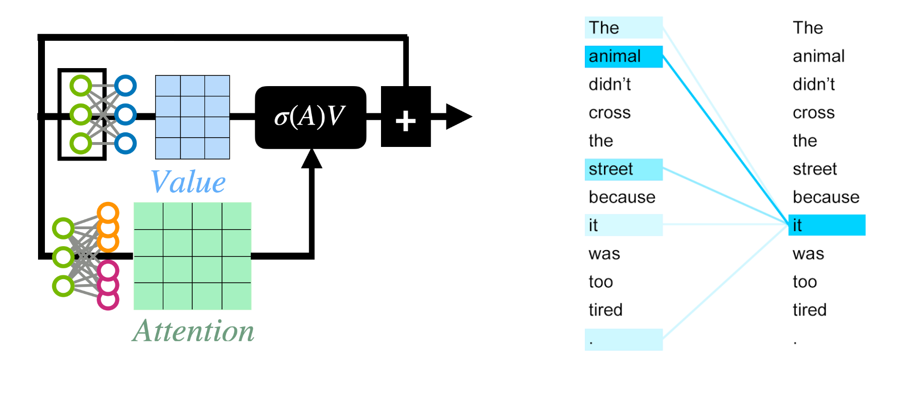
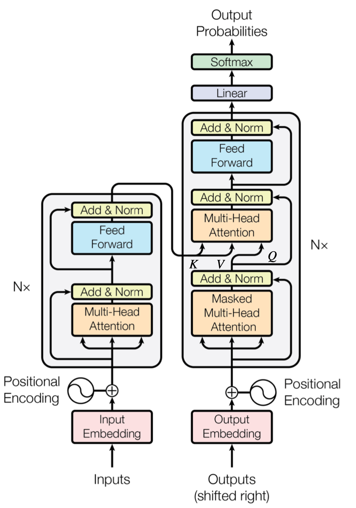

- #### Attention, Self Attention, Cross Attention
  - www
- #### Cross Attention
- #### Modality gap
- #### CLIP
- #### Policy Network
- #### stable diffusion
- #### GPTQ
- #### temperature
- #### tokenlize tool
---
<br>


# Attention, Self-Attention 與 Cross-Attention


## 1. Attention（注意力）

**核心想法**：用「查詢」(Query, **Q**) 比對「鍵」(Key, **K**)，得到權重，對「值」(Value, **V**) 做加權平均得到輸出。

**Scaled Dot-Product Attention：**
$$
\mathrm{Attn}(Q,K,V)
= \mathrm{softmax}\!\left(\frac{QK^{\top}}{\sqrt{d_k}} + \mathrm{mask}\right)V
$$

- \(Q\)：來自**目標序列**（要產生輸出的那一側）
- \(K, V\)：來自**來源序列**（被查詢的那一側）
- \(\sqrt{d_k}\) 用來穩定 softmax 的數值尺度
- **mask** 可遮蔽不該看的位置（未來詞、padding）

> 直觀比喻：Q 是「問題」，K 是索引，V 是內容。
> 


---

## 2. Self-Attention（自注意力）

**定義**：**Q、K、V 都來自同一個序列** \(X\)。

$$
Q = XW_Q,\quad K = XW_K,\quad V = XW_V
$$

- 每個位置能「看」到同序列的其他位置，融合全局脈絡。
- **解碼器生成**時需加 **因果遮罩（causal mask）**，避免看到未來。
- 複雜度：序列長度 \(n\) 時約 \(O(n^2 d)\)。

**用途**
- **編碼器（Encoder）**：雙向 self-attention（不遮未來）。
- **解碼器（Decoder）**：遮罩 self-attention（只看過去）。

---

## 3. Cross-Attention（交互注意力）

**定義**：**Q 來自目標序列（如解碼器），K、V 來自另一個來源序列（如編碼器輸出）**。

$$
Q = YW_Q,\quad K = ZW_K,\quad V = ZW_V,\qquad (Y \neq Z)
$$

- 生成第 \(t\) 步時，用 \(Q\) 去查詢來源表示（\(K,V\)）。
- **不需要因果遮罩**（來源序列已完整可見），但需 **padding mask**。
- 複雜度：若解碼長度 \(n\)、來源長度 \(m\)，約 \(O(nmd)\)。

**典型場景**
- 機器翻譯：Decoder 讀取 Encoder 的輸入表示。
- 多模態：文字 token（Q）去 cross-attend 影像 patch（K、V）。
- 擴散/控制：UNet 用 cross-attn 注入文字條件到影像特徵。

---

## 4. Self vs Cross 的關係
> **Self-attention 是 cross-attention 的特例**：當目標序列與來源序列相同（\(Y=Z\)）時，cross 就退化為 self。

---

## 5. Multi-Head Attention（多頭注意力）

將表示空間切成多個子空間，各頭分別計算注意力後再拼接：
$$
\mathrm{MHA}(Q,K,V)
= \mathrm{Concat}\Big(\mathrm{Attn}(QW_Q^{(i)},KW_K^{(i)},VW_V^{(i)})\Big)_i \, W_O
$$

**好處**
- 不同頭可關注不同關係（語法、語義、位置對齊等），增強表達力且可並行。

> 變體：**MQA**（多查詢共享 \(K,V\)）與 **GQA**（查詢分組共享 \(K,V\)）在推論更省記憶體。

---

## 6. Transformer 中的位置（結構）

- **Encoder Block**：LayerNorm → **Self-Attn** → 殘差 → LayerNorm → FFN → 殘差  
- **Decoder Block**：LayerNorm → **Masked Self-Attn** → 殘差 → LayerNorm → **Cross-Attn** → 殘差 → LayerNorm → FFN → 殘差

> Encoder 沒有 cross-attn；Decoder 多了 cross-attn 讀取 Encoder 上下文。




---

## 7. Mask 的三種常見用途
1. **Causal mask**（上三角遮罩）：生成時避免看未來（*只用在 decoder self-attn*）。  
2. **Padding mask**：忽略補齊位置（self / cross 都常用）。  
3. **選擇性可見性**：多模態中限制跨模態或跨段可見範圍。
   

---

## 8. 計算與效率
- Self-attn：\(O(n^2)\)；長序列成本高。  
- Cross-attn：\(O(nm)\)；若 \(m\ll n\) 通常更省。  
- **長序列技巧**：稀疏/線性注意力、FlashAttention、滑動窗、檢索式壓縮等。

---

## 9. 口試易混點
- Q/K/V **不是機率**；softmax 後的注意力權重才是分佈（每列和為 1）。  
- 除以 \(\sqrt{d_k}\) 為避免 softmax 飽和、穩定梯度。  
- 注意力本身**不含順序**，需位置編碼/旋轉位置嵌入（RoPE）。  
- Decoder 的 **cross-attn 不用因果遮罩**（看的是 encoder 的完整輸入）。

---

## 10. 口試速答模板（30–60 秒）
- **Attention**：用 \(QK^\top\) 算相似度 → softmax 權重 → 加權 \(V\)。  
- **Self-Attn**：\(Q=K=V\) 皆來自同一序列；decoder 版本需遮罩。  
- **Cross-Attn**：\(Q\) 來自目標，\(K,V\) 來自來源（如 encoder 輸出/圖像特徵/檢索文件）。  
- **關係**：Self 是 Cross 的特例。  
- **Multi-Head**：多子空間並行關聯、最後拼接。

---

## 11. 簡易 PyTorch 偽碼
```python
# X: target seq (B, n, d)   Y: source seq (B, m, d)   self-attn 時令 Y = X
Q = X @ W_Q                      # (B, n, d_k)
K = Y @ W_K                      # (B, m, d_k)
V = Y @ W_V                      # (B, m, d_v)

scores = (Q @ K.transpose(-2, -1)) / sqrt(d_k)  # (B, n, m)
scores += mask                                  # causal/padding
weights = softmax(scores, dim=-1)               # (B, n, m)
O = weights @ V                                 # (B, n, d_v)
