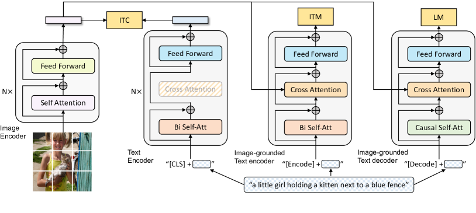

以下是 **Modality Gap（模態鴻溝）** 的詳細說明，包含定義、成因、在多模態模型中的影響以及常見解決方法。

---

##  定義 — 什麼是 Modality Gap

**Modality Gap** 指的是在多模態（multi-modal）學習中，不同資料模態（如文字、圖像、語音、影片）之間在**特徵分布、語義對齊**上存在的差距。

> 換句話說，模型在處理兩種不同的資料來源時，因為每種模態的特徵空間和統計分布差異很大，導致難以直接對齊或共享語義。

例如：

* **文字 (text)**：符號化、稀疏且具有明確語法結構。
* **影像 (image)**：連續的像素值，沒有明確的離散語法，語義高度隱含。
* **音訊 (audio)**：頻譜訊號，時間序列性強，特徵與語義之間的對應不直觀。

當模型嘗試把不同模態投影到同一個語義空間時，這些差異會造成**學習不穩定或語義錯位**。

---

##  成因分析

### (1) **統計分布差異**

* 圖像特徵通常是高維連續值，語言是低維離散字元或 token。
* 語言模型學習的是語法結構與上下文依賴，圖像模型則注重空間鄰近與局部結構。

### (2) **語義抽象層次不同**

* 文字的語義通常比較抽象（如「一隻貓」直接表達概念），
* 圖像必須經由卷積或視覺編碼器逐層抽取，才能到達與「貓」對應的高階語義。

### (3) **資料分布不均衡**

* 文本資料量通常遠大於影像或語音資料量。
* 訓練時若文本權重過高，會造成圖像特徵在共同嵌入空間中被弱化。

### (4) **預訓練任務不一致**

* NLP 常用的任務是 Masked Language Modeling (MLM)，
* CV 常用的任務是圖像分類或 CLIP-style contrastive learning。
  這種不同的預訓練目標本身就可能造成特徵分佈差異。

---

##  影響

* **對齊困難**：模型很難把同一語義的圖像與文字映射到鄰近位置。
* **跨模態檢索失準**：例如 CLIP 若 modality gap 大，影像檢索文字描述會不準確。
* **生成品質下降**：在影像生成或文本生成中出現語義不一致，例如文字描述「一隻黑貓」卻生成灰色貓。
* **微調效率低**：需要大量標註資料才能縮小 gap。

---

##  常見解決策略

### 🔹 (A) 統一表示空間

* **CLIP-style Contrastive Learning**

  * 讓圖像編碼器與文字編碼器同時學習，使同一對 `(image, text)` 的嵌入距離最小化，不同對最大化。
* **共享 Transformer Backbone**

  * 如 Flamingo、BLIP-2 中，將影像特徵投影成 token，與文字一同進入大型語言模型。

### 🔹 (B) 預訓練橋接 (Pre-training Bridge)

* **Vision-to-Text Adapter**：如 BLIP-2 的 Q-Former，把影像轉換成語言模型可理解的 query token。
* **多階段訓練**：先單模態預訓練，再用少量跨模態資料做對齊微調。

### 🔹 (C) 正則化與分布對齊

* **Maximum Mean Discrepancy (MMD)**：最小化不同模態嵌入的分布差異。
* **Adversarial Learning**：透過對抗訓練讓兩個模態的特徵空間無法被辨識。

### 🔹 (D) 資料增強

* **合成配對資料**：利用 captioning 或生成模型補足缺乏的對齊資料（例如用大語言模型自動生成圖片描述）。
* **跨模態噪聲注入**：增加對 domain shift 的魯棒性。

---

##  經典案例

| 模型                | 如何處理 Modality Gap                                  |
| ----------------- | -------------------------------------------------- |
| **CLIP (OpenAI)** | 對比學習：最大化 `(image, text)` 對的相似度，縮小 gap。             |
| **ALIGN / LiT**   | 大規模圖文對比學習，利用更多資料降低分布差異。                            |
| **BLIP / BLIP-2** | 引入 Q-Former（query transformer）橋接視覺特徵與語言模型。         |
| **Flamingo**      | 使用 gated cross-attention layers 把圖像 token 融合到 LLM。 |
| **PaLI / PaLM-E** | 直接在 LLM 裡加入視覺 embedding，並用大量跨模態資料對齊。               |

---

##  總結

* **Modality Gap 是多模態 AI 的核心挑戰之一**，源於不同資料模態的統計特性、語義層級和訓練目標差異。
* **解決策略主要分為：對比學習對齊、橋接模組、分布正則化、以及資料增強。**
* 新一代多模態模型（如 BLIP-2、Flamingo、PaLM-E）都致力於縮小這個 gap，以實現真正高效的跨模態理解與生成。

---


# CLIP 如何解決 Modality Gap

---

## 1️⃣ CLIP 的核心挑戰與目標
在 CLIP 出現之前，圖像與文字常在 **不同空間** 中訓練：  
- 圖像模型（CNN、ViT）學習分類或檢測，語義空間只與標籤對齊。  
- NLP 模型（BERT、GPT）學習語言結構，無法直接理解圖像特徵。  

👉 **結果**：兩個模態的嵌入空間差異大，無法直接對齊，形成 **modality gap**。  
CLIP 的目標是 **將圖像和文字對映到同一個共享語義空間**，並讓對應的圖像與文字距離靠近，不對應的距離遠離。

---

##  CLIP 的架構設計

### 🔹 2.1 雙編碼器 (Dual-Encoder)
CLIP 同時訓練：
- **Image Encoder**：輸入影像 \(x_i\) 得到向量 \(v_i\)。
- **Text Encoder**：輸入描述文字 \(t_i\) 得到向量 \(u_i\)。

> **關鍵**：圖像和文字不共享權重，但最終都投影到同一個 **d 維度的 embedding space**。

---

### 🔹 2.2 對比式學習 (Contrastive Learning)
CLIP 使用 **對比損失 (InfoNCE)**，同時對影像到文字、文字到影像做匹配。

#### Loss 公式

假設一個 batch 有 \(N\) 對圖文 \((x_i, t_i)\)：  

- 圖像特徵  
$$
v_i = f_{\text{img}}(x_i)
$$  

- 文字特徵  
$$
u_i = f_{\text{txt}}(t_i)
$$  

- Cosine similarity  
$$
s_{ij} = \frac{v_i \cdot u_j}{\|v_i\|\|u_j\|}
$$  

- 影像到文字的損失  
$$
L_{\text{img}\to \text{text}} = -\frac{1}{N}\sum_{i=1}^N \log \frac{\exp(s_{ii}/\tau)}{\sum_{j=1}^N \exp(s_{ij}/\tau)}
$$  

- 文字到影像的損失  
$$
L_{\text{text}\to \text{img}} = -\frac{1}{N}\sum_{i=1}^N \log \frac{\exp(s_{ii}/\tau)}{\sum_{j=1}^N \exp(s_{ji}/\tau)}
$$  

- 總損失  
$$
L = \frac{1}{2}\Big(L_{\text{img}\to \text{text}} + L_{\text{text}\to \text{img}}\Big)
$$  

其中 \(\tau\) 是 **learnable temperature parameter**，控制 softmax 對相似度的敏感度。

訓練過程中：
- **正樣本 (paired image-text)** 被拉近  
- **負樣本 (不相關的組合)** 被推遠  
最終達到跨模態的語義對齊。

---

##  CLIP 的關鍵技術
| 技術 | 解決問題 | 成果 |
|------|----------|------|
| 對比學習 (Contrastive Loss) | 強制影像與文字特徵空間靠近 | 語義對齊 |
| 雙塔架構 (Dual-Encoder) | 各自最佳化，但共享語義空間 | 避免資訊干擾 |
| 大規模圖文配對 (400M pairs) | 提供豐富語義樣本 | 泛化能力強 |
| 溫度參數 \(\tau\) | 動態調整區分度 | 提升收斂效果 |
| 文本使用 Transformer | NLP Encoder 提供上下文語義 | 減少語言與視覺差異 |

---

##  視覺化理解


傳統：
Image Encoder -> 圖像空間
Text Encoder  -> 語言空間
(兩個空間距離遠)

CLIP：
Image Encoder ---
--> 同一語義空間 (joint embedding space)
Text Encoder  ---/


# CLIP (Contrastive Language–Image Pre-training) 詳細介紹

---

##  背景與動機
在深度學習的早期，圖像與文字通常分開訓練：
- **圖像模型 (CNN/ViT)**：使用 ImageNet 分類或檢測任務，學到的語義有限。
- **語言模型 (BERT/GPT)**：專注於文字語法和語意關係，但無法理解影像。

>  問題：兩種模態各自學習，**缺乏統一的語義空間**，無法直接進行圖像–文字對齊，也難以做跨模態檢索或 Zero-shot 分類。

OpenAI 在 2021 年提出 **CLIP**，希望：
1. **將圖像和文字對映到同一個嵌入空間 (joint embedding space)**。
2. 使用**自然語言描述**來替代傳統分類標籤，增加模型的泛化能力。
3. 利用 **大規模網路收集的圖文對**，在無需專門標註的情況下進行訓練。

---

##  架構概覽


###  雙編碼器 (Dual-Encoder)
- **Image Encoder**：可選 ResNet-50/101 或 Vision Transformer (ViT)。
- **Text Encoder**：Transformer 結構 (類似 GPT/BERT)。
- 最後都輸出同維度向量，並 **L2 normalize**。

###  對比學習 (Contrastive Learning)
- 把圖像和文字的語義空間 **對齊**。
- 用 **InfoNCE Loss** 同時優化「圖像→文字」和「文字→圖像」匹配。

#### 數學公式
假設 batch 大小為 \(N\)：

- 圖像特徵：
$$
v_i = f_{\text{img}}(x_i)
$$

- 文字特徵：
$$
u_i = f_{\text{txt}}(t_i)
$$

- Cosine 相似度：
$$
s_{ij} = \frac{v_i \cdot u_j}{\|v_i\|\|u_j\|}
$$

- 圖像→文字方向：
$$
L_{\text{img}\to \text{text}} = -\frac{1}{N}\sum_{i=1}^N \log \frac{\exp(s_{ii}/\tau)}{\sum_{j=1}^N \exp(s_{ij}/\tau)}
$$

- 文字→圖像方向：
$$
L_{\text{text}\to \text{img}} = -\frac{1}{N}\sum_{i=1}^N \log \frac{\exp(s_{ii}/\tau)}{\sum_{j=1}^N \exp(s_{ji}/\tau)}
$$

- 總損失：
$$
L = \frac{1}{2}\Big(L_{\text{img}\to \text{text}} + L_{\text{text}\to \text{img}}\Big)
$$

其中 \(\tau\) 是 **learnable temperature parameter**，用於調整 softmax 的尖銳程度。

---

##  大規模訓練資料
- CLIP 使用約 **4 億對 (400M) 圖文配對**，大多從網路收集 (如 alt-text)。
- 與 ImageNet 的單一標籤相比，自然語言描述更豐富，例如：
  - 圖像：🐱
  - ImageNet 標籤：「cat」
  - CLIP 文字描述：「a close-up photo of a cute black cat with green eyes sitting on a window sill」

>  更細緻的描述幫助模型學到高層次語義。

---

## (Recap) 如何解決 Modality Gap

| 方法 | 說明 | 作用 |
|------|------|------|
| **對比式訓練 (Contrastive Learning)** | 以 InfoNCE 同時最小化正樣本距離、最大化負樣本距離 | 將影像與文字拉到同一空間 |
| **雙編碼器設計 (Dual-Encoder)** | 保留各自模態特性，再對齊到同維度空間 | 避免過早混合資訊 |
| **大規模圖文資料** | 使用海量配對減少分布差異 | 改善泛化能力 |
| **溫度參數 \(\tau\)** | 控制正負樣本分離的難度 | 提升收斂與對比效果 |
| **自然語言標註** | 用自由文本取代單一類別標籤 | 降低語義鴻溝、提高遷移性 |

---

##  應用場景

### Zero-shot 圖像分類
1. 對每個類別輸入描述（prompt engineering）：
```

"a photo of a cat"
"a photo of a dog"

```
2. 計算圖片與各描述的 cosine 相似度。
3. 相似度最高的類別即為預測結果。

###  圖像–文字檢索
- 給一張圖像，找最相關的文字描述。
- 或給一句描述，搜尋最相關的圖片。

###  Downstream Fine-tuning
- 只需少量資料即可適應新任務，如醫學影像、衛星影像。

---

## 6 優勢與貢獻

- **Zero-shot 能力強**：不需特定任務的微調。
- **語義對齊泛化佳**：能處理各種開放域文字描述。
- **訓練資料成本低**：利用網路已有圖文對，不必人工標註。

---

##  限制與挑戰

| 限制 | 說明 |
|------|------|
| 資料噪音 | 網路收集的 alt-text 描述品質不一，可能錯誤或模糊。 |
| 細粒度對齊不足 | 無法做到區域級（如物件與詞語的精準對應）。 |
| 偏見與安全性 | 訓練資料來源不受控，可能學到社會偏見或不安全語義。 |
| 高計算成本 | 需要大量 GPU/TPU 運算資源預訓練。 |

---

##  後續模型的改進

| 模型 | 改進重點 |
|------|----------|
| **ALIGN** | 使用更大、更乾淨的資料集，提升語義對齊。 |
| **LiT (Locked-image Text Tuning)** | 鎖定影像編碼器，只調整文字編碼器微調。 |
| **BLIP / BLIP-2** | 引入 Q-Former 將影像 token 化以更好與 LLM 結合。 |
| **Flamingo** | Gated Cross-Attention Layer，讓 LLM 能持續處理影像序列。 |
| **PaLM-E** | 在 PaLM LLM 上加入視覺 embedding，形成通用多模態模型。 |

---

## 9️⃣ 總結
- **CLIP = 大規模對比學習 + 雙編碼器架構**，核心目標是**統一圖像與文字語義空間**，解決 Modality Gap。  
- 成功原因：
- 大規模圖文對
- 對比式損失 (InfoNCE)
- 自然語言描述取代單一標籤  
- 優勢是 **零樣本泛化強**、**跨模態檢索表現佳**，是多模態模型的重要里程碑。
---
下面是 **BLIP (Bootstrapped Language-Image Pre-training)** 與 **BLIP-2** 的完整介紹，使用 **Markdown + LaTeX** 格式，方便學習與展示。

---


# BLIP 與 BLIP-2 詳細介紹

---

## 1️⃣ 背景與動機

CLIP 透過大規模對比學習 (contrastive learning) 成功縮小 **modality gap**，但仍存在一些限制：
- 缺乏 **生成能力**：CLIP 僅能做檢索與分類，無法生成描述 (caption)。
- 缺乏 **細粒度對齊**：CLIP 對圖像整體做 embedding，無法精確連結影像區域與文字詞彙。
- 對 **下游任務適應性不足**：需要額外微調才能在 VQA (Visual Question Answering)、Image Captioning 表現良好。

為此，Salesforce 在 2022 年提出 **BLIP**，目標是：  
> **在單一模型中同時支援圖像–文字理解與生成**，並透過「自我訓練 (Bootstrapping)」降低對人工標註資料的依賴。

2023 年又提出 **BLIP-2**，進一步把 **大型語言模型 (LLM)** 與視覺編碼器結合，達成高效的多模態推理。

---

## 2️⃣ BLIP 架構


BLIP 的核心由三部分組成：

1. **Vision Encoder**  
   - 使用 ViT 或 CNN，將影像轉成 patch embedding。
2. **Multimodal Transformer**  
   - 接收影像 token 與文字 token，透過 cross-attention 對齊模態。
3. **Language Decoder**  
   - 支援文字生成（例如影像描述、問答）。

---

### 🔹 預訓練策略

BLIP 引入三種 **自監督 / 弱監督** 任務：

1. **Image–Text Contrastive Learning (ITC)**  
   - 與 CLIP 類似，讓圖像與文字匹配。
   $$
   L_{ITC} = - \log \frac{\exp(\text{sim}(v,t)/\tau)}{\sum_j \exp(\text{sim}(v,t_j)/\tau)}
   $$

2. **Image–Text Matching (ITM)**  
   - 判斷給定的圖文是否匹配（二元分類任務），提升語義對齊。

3. **Image Captioning (IC)**  
   - 給圖像生成文字描述，提升模型的語言生成能力。

> 這三種損失組合，使 BLIP 同時學會 **對比對齊、語義理解與生成**。

---

### 🔹 Bootstrapped Training

- 利用現有的圖像–文字資料，先訓練一個初始模型生成 caption。
- 將生成的 caption 當作新的訓練資料，擴大訓練集並迭代改善。
- 減少對人工標註 caption 的依賴，降低資料成本。

---

## 3️⃣ BLIP-2 架構

BLIP-2 在 BLIP 的基礎上，針對 **多模態推理** 做了重要升級。

```

Image ─► Vision Encoder (凍結)
│
▼
Q-Former ─► Query Tokens
│
▼
Large Language Model (LLM)

```

### 🔹 關鍵設計 — Q-Former

- **Querying Transformer (Q-Former)**：一個輕量的 transformer 模組。  
- 功能：  
  1. 接收影像特徵，生成 **一組 Query Tokens**。  
  2. 這些 tokens 與 LLM 互動，將視覺資訊高效輸入語言模型。  
- 優點：  
  - 不需微調整個 LLM，只需訓練 Q-Former → **參數效率高**。
  - 可使用 **凍結的預訓練 ViT** 與現成 LLM（如 Flan-T5、OPT、LLaMA）。

---

### 🔹 訓練流程
1. **階段一：Image–Text 對齊預訓練**  
   - 使用對比學習與 ITM 將 Q-Former 對齊影像與文字。
2. **階段二：與 LLM 對接**  
   - 將 Q-Former 輸出作為 LLM 的輸入，學習在多模態任務上生成答案或描述。

---

## 4️⃣ BLIP 與 CLIP 的差異

| 特徵 | CLIP | BLIP | BLIP-2 |
|------|------|------|-------|
| 架構 | 雙編碼器 | Encoder–Decoder + Multimodal Transformer | Vision Encoder + Q-Former + LLM |
| 任務 | 對比學習、檢索 | 對比 + Caption + ITM | 高效與 LLM 結合，支援推理 |
| 生成能力 | ❌ 無 | ✅ 有 | ✅ 有，且與 LLM 整合 |
| 細粒度對齊 | 弱 | 中等 | 強 (Q-Former 提供豐富視覺 token) |
| 資料需求 | 大量圖文對 | 大量圖文對，可自我擴增 | 可利用現有 LLM，減少訓練成本 |

---

## 5️⃣ 應用場景

- **圖像檢索 / 文本檢索**（與 CLIP 類似，但效果更佳）
- **影像描述生成 (Image Captioning)**  
- **視覺問答 (VQA, Visual Question Answering)**  
- **Zero-shot / Few-shot 多模態任務**  
- **多模態對話系統**（BLIP-2 結合 LLM 後特別強）

---

## 6️⃣ 優勢

- **同時具備理解與生成能力**，比 CLIP 更通用。
- **Bootstrapped 自訓練**：降低人工標註依賴。
- **BLIP-2 參數效率高**：只需訓練 Q-Former，LLM 可凍結。
- **支援開放域推理**：特別是 BLIP-2 + LLM 的組合。

---

## 7️⃣ 限制與挑戰

| 限制 | 說明 |
|------|------|
| 訓練複雜度高 | 結合多種任務，實作難度較 CLIP 高。 |
| 仍依賴大量資料 | 雖然自訓練減少標註，但仍需龐大圖文對。 |
| LLM 依賴 | BLIP-2 成效取決於 LLM 的語言能力。 |

---

## 8️⃣ 後續影響

- **BLIP-2** 成為許多多模態大型模型 (如 LLaVA、InstructBLIP) 的基礎。
- **InstructBLIP**：在 BLIP-2 上加入 instruction tuning，支援更自然的對話。
- **LLaVA**：直接用 Q-Former + LLaMA + Instruction-tuning，建立強大的多模態聊天模型。

---

## 9️⃣ 總結

- **BLIP**：在 CLIP 基礎上加入 **ITM + Captioning**，讓模型具備 **理解 + 生成** 雙能力。  
- **BLIP-2**：進一步引入 **Q-Former**，有效結合現成 **LLM**，實現 **高效多模態推理**。  
- 這條路線已成為後續多模態 AI 的主流架構之一。

```

---


