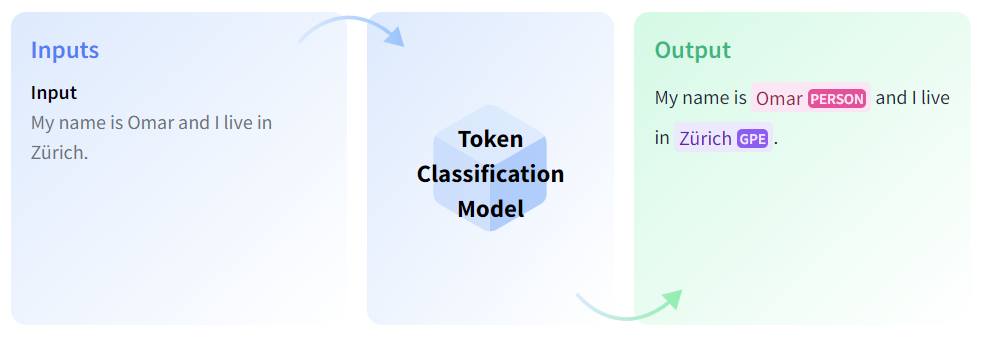
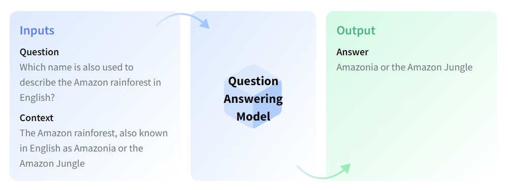
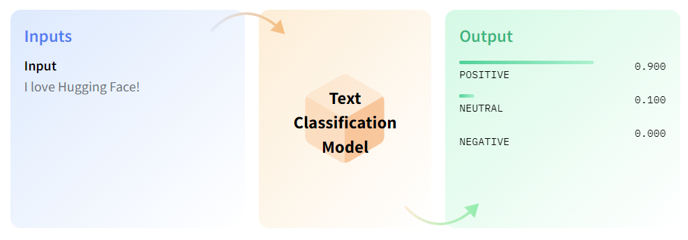
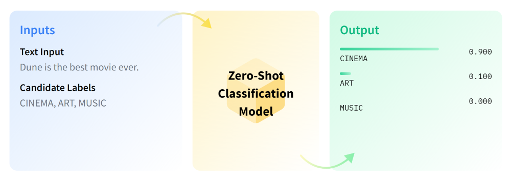

<center><a href="https://www.nvidia.com/en-us/training/"></a></center>

# <font color="#76b900">**Notebook 3:** LLM Encoder Tasks</font>

In the previous notebook, you went deeper into the HuggingFace &#x1F917; pipeline to see how the LLMs handle natural language. In this notebook, we'll be pushing the BERT encoder to other potential tasks aside from the unmasking task by introducing task-specific modifications.

#### **Learning Objectives:**

- Learn how to use task-specific pipelines that cover token-level, passage-level, and range-subsetting tasks. 
- Use the same abstractions to enable zero-shot classification of inputs into arbitrary classes without re-training.

<hr>
<br>

## **Part 3.1:** The Token Prediction Task Head

Previously, we stumbled upon the unmasking pipeline and did a bit of exploration to see how it operated. Let's revisit it for a bit and see what's going on in the model:


```python
from transformers import BertTokenizer, BertModel, FillMaskPipeline, AutoModelForMaskedLM

unmasker = FillMaskPipeline(
    tokenizer = BertTokenizer.from_pretrained('bert-base-uncased'),
    model = AutoModelForMaskedLM.from_pretrained("bert-base-uncased")
)
unmasker("Hello, Mr. Bert! How is it [MASK]?")
```

We previously discussed the strategies employed by the LLMs to perform their reasoning, namely by:
- Learning an encoding for the tokens and sequence entries that captures semantic and positional information.
- Providing a limited interface *(i.e. attention)* to allow some reasoning across the token boundary, while also loosely enforcing the token boundaries *(i.e. with residual connections)*.

This is the default utility of the **Transformer Encoder**; to take in a sequence, and spit out a latent sequence:

- The sequence of tokens goes in.
- The sequence propagates through the network.
- A sequence of vectors comes out.

With this in mind, the mechanism behind the unmasker should be rather intuitive. If the output of the transformer layers is semantically rich in both its meaning and context, we can just pass each embedded entry through a dense net to perform **token-level prediction**!

```python
#<s>  hello  world  and  all  who  live  in  it ... </s>  (in target input space)
#p_0   p_1    p_2   ...                           p_(n-1) (probs for target input space)
  |     |      |     |    |    |    |    |   |        |
  v     v      v     v    v    v    v    v   v        v

"e_0   e_1    e_2   ...                           e_(n-1) (pretrained backbone embedding)
" |     |      |     |    |    |    |    |   |        |
" v     v      v     v    v    v    v    v   v        v
"
"          [[BERT-like Transformer Backbone]]
"
" |     |      |     |    |    |    |    |   |        |
" v     v      v     v    v    v    v    v   v        v
"
"l'0   l'1    l'2   ...                           l'(n-1) (pretrained backbone latents)
  |     |      |     |    |    |    |    |   |        |
  v     v      v     v    v    v    v    v   v        v             

                 [[Task-Specific Head]]

  |     |      |     |    |    |    |    |   |        |
  v     v      v     v    v    v    v    v   v        v             
#p'0   p'1    p'2   ...                           p'(n-1) (probs for target output space)
```

**When this prediction granularity is used to sort the tokens into classes, that's called [Token Classification](https://huggingface.co/tasks/token-classification)!** The variant we're observing in this notebook, [**mask filling**](https://huggingface.co/tasks/fill-mask), occurs when the output space is the space of tokens. 

<div></div>

With that in mind, let's look at the `(cls)`, or the **classification head** component of our unmasking model:

```python
unmasker.model.cls
```

```python
BertOnlyMLMHead(
  (predictions): BertLMPredictionHead(
    (transform): BertPredictionHeadTransform(
      (dense): Linear(in_features=768, out_features=768, bias=True)
      (transform_act_fn): GELUActivation()
      (LayerNorm): LayerNorm((768,), eps=1e-12, elementwise_affine=True)
    )
    (decoder): Linear(in_features=768, out_features=30522, bias=True)
  )
)
```

Feel free to look at [the source code](https://github.com/huggingface/transformers/blob/7a6efe1e9f756f585f2ffe5ada22cf6b15edd23b/src/transformers/models/bert/modeling_bert.py#L686) to see exactly how this is implemented, but the logic here is pretty simple:

- Given BERT's 768-D output vectors, run each one through a dense layer with [GELU Activation](https://pytorch.org/docs/stable/generated/torch.nn.GELU.html) and [Layer Normalization](https://pytorch.org/docs/stable/generated/torch.nn.LayerNorm.html).
    - **GELU [Gaussian Error Linear Unit]:** Like ReLU, but a bit smoother.
    - **LayerNorm:** Already discussed; Helps normalize output for smoother optimization.  
- Feed that through one more dense layer at the end to go from the latent logits to a probability over the set of possible tokens.

So in other words, give the classifier a bit of non-linear reasoning capabilities, and then finally predict the tokens for the final output. Not too bad, right? **In theory and practice, this should be sufficient to predict a new output token for each input token!** 

To verify that the shapes are as expected, we can flesh out the pipeline a little more by dividing the forward pass and printing out the intermediate shapes:


```python
from transformers import BertTokenizer, BertModel, FillMaskPipeline, AutoModelForMaskedLM
import torch

class MyFillMaskModel(FillMaskPipeline):
    def __init__(self):
        super().__init__(
            tokenizer = BertTokenizer.from_pretrained("bert-base-uncased"),
            model = AutoModelForMaskedLM.from_pretrained("bert-base-uncased")
        )

    def __call__(self, string):
        # input_tensors = self.preprocess(string)
        # output_tensors = self.forward(input_tensors)
        # output = self.postprocess({**input_tensors, **output_tensors})

        ## This is what we get from preprocessing (which depends on both task and model)
        input_tensors = unmasker.preprocess(string)
        mask_idx = (input_tensors['input_ids'] == 103).nonzero()[0][1].item()
        print("\nStatistics From Input:")
        print(" > Input Indices:", input_tensors['input_ids'])
        print(" > Input Decoding:", [unmasker.tokenizer.decode(token_index) for token_index in input_tensors['input_ids'][0]])
        print(" > Mask Index:", mask_idx)

        ## This is what we get throughout the model forward pass
        inputs_1 = {'input_ids' : input_tensors['input_ids']}
        inputs_2 = {'attention_mask' : input_tensors['attention_mask'].bool()}
        embed_out = unmasker.model.bert.embeddings.forward(**inputs_1)
        bert_out = unmasker.model.bert.encoder.forward(embed_out, **inputs_2)['last_hidden_state']
        y = unmasker.model.cls.forward(bert_out)
        print("\nStatistics From Forward Pass:")
        print("> Input Into BERT Encoder:", embed_out.shape)
        print("> Input Into Classifier:  ", bert_out.shape)
        print("> Output From Classifier: ", y.shape)

        ## The following statistics are generic outputs from the BERT differentiable pipeline
        pdfs = torch.softmax(y[0], -1)  ## List of probability vectors (i.e. sum(pdf[0]) == 1)
        print("\nStatistics From BERT Output:")
        print(" > Most-Likely Index:", torch.tensor([torch.argmax(pdf).item() for pdf in pdfs]))
        print(" > Most-Likely Probs:", torch.tensor([torch.max(pdf).item() for pdf in pdfs]))
        print(" > Most Likely Words:", [unmasker.tokenizer.decode(torch.argmax(pdf).item()) for pdf in pdfs])

        ## The following statistics are task-specific post-processings of the output
        k = 5
        mask_top_probs = torch.topk(pdfs[mask_idx], k)
        mask_best_words = [unmasker.tokenizer.decode(index) for index in mask_top_probs.indices]
        print(f"\nStatistics From Postprocessing (Top {k}):")
        print(" > Most Likely Mask Index:", mask_top_probs.indices)
        print(" > Most Likely Mask Probs:", mask_top_probs.values.detach())
        print(" > Most Likely Mask Words:", mask_best_words, "\n")

        output = self.postprocess({**input_tensors, 'logits' : y})        
        return output


unmasker = MyFillMaskModel()
unmasker("Say [MASK]!")[0]
```

We can see here that the `postprocess` phase performs some extra function to make the pipeline work, and you are free to check out exactly how that happens in the [source code](https://github.com/huggingface/transformers/blob/95b374952dc27d8511541d6f5a4e22c9ec11fb24/src/transformers/pipelines/fill_mask.py#L105). Not surprisingly, postprocess just finds the first `[MASK]` instance in the string and sees which entries in the predicted probability vector have the highest values (known as **argmax-ing**, where the argument here is the index).

<hr>
<br>

## **Part 3.2:** Token-Level Prediction For Range Outputs

The above task was an example of a natural token-in token-out task and conveniently maps to most BERT-like models' primary training objective:

- [**Masked Language Modeling (MLM)**](https://huggingface.co/docs/transformers/main/tasks/masked_language_modeling)
    - **Training Goal:** Recover the original tokens.
    - **Augmentation:** Among the training data, replace some of the tokens with [MASK] and swap some more with random tokens.
    - **Objective:** Gain bidirectional reasoning skills for per-token tasks.

However, the BERT model is definitely not limited to this task (though your classifier may be)! The point of having pretrained LLM models is to use them as a language-understanding backbone, so we should be able to add different heads to the base model for other types of tasks.

One simple token-level task that is only a little different in specification is the range prediction task! In this one, your classifier is trained to predict the start and end tokens of the model input to generate a subset as the model response. This feature of "your-answer-is-a-substring-of-your-input" is actually quite desirable to limit the reasoning space of smaller models, and for that it has become a popular choice for [Question Answering](https://huggingface.co/tasks/question-answering).

<div></div>


```python
from transformers import AutoModelForQuestionAnswering, AutoTokenizer, pipeline

model_name = "deepset/roberta-base-squad2"

## Example from https://huggingface.co/deepset/roberta-base-squad2
nlp = pipeline('question-answering', model=model_name, tokenizer=model_name)
QA_input = {
    'question': 'Why is model conversion important?',
    'context': 'The option to convert models between FARM and transformers gives freedom to the user and let people easily switch between frameworks.'
}
nlp(QA_input)
```

RoBERTa is another encoder-only model similar to BERT, so its expected inputs and outputs are the same. The main difference as far as we need to see is the fact that the classification head (fine-tuned on the [SQuAD2.0 question-answering dataset](https://huggingface.co/datasets/squad_v2)) only predicts two logits per token; a start probability and an end probability.

You can verify this functionality by looking at the new classification head, which you may notice is a lot simpler than the unmasker:

```python
nlp.model.qa_outputs
```
> ```python
(qa_outputs): Linear(in_features=768, out_features=2, bias=True)
```

After this light $768 \to 2$ transfer, the postprocessing just needs to figure out a desirable range to start and end the sequence (i.e. by maximizing the sum of the two predicted logits) and we have a substring prediction model!

```python
#<s>  hello  world  and  all  who  live  in  it ... </s>  (in target input space)
#p_0   p_1    p_2   ...                           p_(n-1) (probs for target input space)
  |     |      |     |    |    |    |    |   |        |
  v     v      v     v    v    v    v    v   v        v
           [[BERT-like Transformer Backbone]]
  |     |      |     |    |    |    |    |   |        |
  v     v      v     v    v    v    v    v   v        v             
                 [[Task-Specific Head]]
  |     |      |     |    |    |    |    |   |        |
  v     v      v     v    v    v    v    v   v        v             
"pse0  pse1   pse2  ...                           pse(n-1) (prob starting & prob ending)
```

The same rough formulation can be applied for text summarization or whatever substring task you want, and the benefits/limitations are clear; **the prediction is explicitly limited to be a subset of the inputs!** This can be especially important when your application needs stability and risk aversion (i.e. for a public-facing application), but can also be viewed as a drawback since the restriction prevents conversational outputs.

<hr>
<br>

## **Part 3.3:** The Sequence-Level Classification Head

Now recall that in addition to the Masked Language Model task in BERT, the model was also trained on the NSP task:

- **Next-Sentence Prediction (NSP)**
    - **Training Goal:** Predict in if sentence A follows sentence B.
    - **Augmentation:** Lump together sentence pairs, with 50% chance of A and B appearing in that order in the dataset.
    - **Objective:** Enforce long-span reasoning and endow the first token with  general classification skills.

The **MLM** objective is central to many BERT-like LLMs, but the **NSP** task has admittedly been contested since its incorporation in BERT. It does make sense that consolidating longer-spanning logic into specific parts of the model output would improve the model's language reasoning ability, but follow-up architectures have played around with dropping the objective (see [**RoBERTa**](https://huggingface.co/docs/transformers/model_doc/roberta)) or swapping it out for other flavors (see [**Albert**](https://huggingface.co/albert-base-v2), which uses sentence-order prediction, or SOP, instead). Regardless of which generalization techniques are used to train an encoder transformer model, the workflow for the classification head is usually quite consistent:

> **Take just a specific (i.e. 0th, `CLS`, etc.) output entry from the base model, and run it through a series of dense layers to form the output shape of choice.**

```python
#<s>  hello  world  and  all  who  live  in  it ... </s>  (in target input space)
#p_0   p_1    p_2   ...                               p_(n-1) (probs for target input space)
  |     |      |     |    |    |    |    |   |        |
  v     v      v     v    v    v    v    v   v        v
           [[BERT-like Transformer Backbone]]
  |     |      |     |    |    |    |    |   |        |
  v     v      v     v    v    v    v    v   v        v             
                 [[Task-Specific Head]]
  |     |      |     |    |    |    |    |   |        |  [  optional task-specific  ]
  v     v      v     v    v    v    v    v   v        v  [ sequence-level reasoning ]
" |     x      x     x    x    x    x    x   x        x  [   discarding of values   ] 
" v           
" p0 probability (or arbitrary vector, multiple probabilities, etc.)
```

**This is called [Text Classification](https://huggingface.co/tasks/text-classification)!**  (or more generally "Sequence Classification"), though the formulation could be generalized beyond classification to include regressional and multi-probability prediction.

<div></div>

<br>

This formulation is great when you need passage-level reasoning, so let's pull in a popular emotion model to illustrate the point:


```python
from transformers import AutoModelForSequenceClassification

emo_model = pipeline('sentiment-analysis', 'SamLowe/roberta-base-go_emotions')

print(emo_model("I love my old pillow?"))
print(emo_model("Why is it that every plant I touch dies within a few days?"))
print(emo_model("I'm so conflicted about these new instructions..."))
```

As we can see, it works perfectly fine despite RoBERTa not relying on the next-sentence prediction task. During internet-scale training, it just manages to pick up on passage-level relationships throughout the network and just needs some supervision to pull it out via the classifier.

Investigating the architecture, you might notice that the shift from token-level and sequence-level classification heads isn't that obvious:

```python
emo_model.model.classifier
```
> ```python
RobertaClassificationHead(
  (dense): Linear(in_features=768, out_features=768, bias=True)
  (dropout): Dropout(p=0.1, inplace=False)
  (out_proj): Linear(in_features=768, out_features=28, bias=True)
)
```


This looks nearly identical to the token-level prediction task we saw earlier. To actually see how the subsetting works in practice,  you can check out the official [`RobertaClassificationHead` source code](https://github.com/huggingface/transformers/blob/f26099e7b5cf579f99a42bab6ddd371bf2c8d548/src/transformers/models/roberta/modeling_roberta.py#L1510):

```python
class RobertaForQuestionAnswering(RobertaPreTrainedModel):
    # ...
    def forward(
        self,
        input_ids: Optional[torch.LongTensor] = None,
        attention_mask: Optional[torch.FloatTensor] = None,
        token_type_ids: Optional[torch.LongTensor] = None,
        position_ids: Optional[torch.LongTensor] = None,
        head_mask: Optional[torch.FloatTensor] = None,
        inputs_embeds: Optional[torch.FloatTensor] = None,
        start_positions: Optional[torch.LongTensor] = None,
        end_positions: Optional[torch.LongTensor] = None,
        output_attentions: Optional[bool] = None,
        output_hidden_states: Optional[bool] = None,
        return_dict: Optional[bool] = None,
    ) -> Union[Tuple[torch.Tensor], QuestionAnsweringModelOutput]:
        ## As you can see, the forward call starts off by passing
        ## the inputs through the base model.
        outputs = self.roberta(
            input_ids,
            attention_mask=attention_mask,
            token_type_ids=token_type_ids,
            position_ids=position_ids,
            head_mask=head_mask,
            inputs_embeds=inputs_embeds,
            output_attentions=output_attentions,
            output_hidden_states=output_hidden_states,
            return_dict=return_dict,
        )

        ## Then, it just has to take the first sequence entry
        ## from the model push it through the dense layers
        ## for a single set of classifications.
        sequence_output = outputs[0]   ### <- Interesting
        logits = self.qa_outputs(sequence_output)
        start_logits, end_logits = logits.split(1, dim=-1)
        start_logits = start_logits.squeeze(-1).contiguous()
        end_logits = end_logits.squeeze(-1).contiguous()
        ## ...
```

Being able to look deeper into open-sourced projects like this is important when you want to see how people *really* make cutting-edge software, so keep that in mind going forward and always be on the lookout for points of confusion thought could be clarified with a bit of digging.

<hr>
<br>

## **Part 3.4:** Zero Shot Classification

So far, we've been talking about how we can modify the encoder formulation for various kinds of outputs **given a single call through the function**. It turns out, however, that we can start to break away from the `n->1` and `n->n` formulation **by allowing for multiple queries to our model**. 

In the subsequent notebooks, we'll be learning about decoders which use the transformer architecture to predict entire sequences autoregressively, one token at a time. These require special training and considerations, but for now we can play around with a different formulation: 

> **Predicting probabilities for classification, one class at a time, until you have a prediction for each of your desired classes!**

**This is called [Zero-Shot Classification](https://huggingface.co/tasks/zero-shot-classification)!**

<div></div>

The term zero-shot might seem unfimiliar if you're new to this space, so let's quickly define some key terms:
> - **Zero-Shot Inference**: A model is asked to predict things that it was never specifically trained to predict. 
> - **Few-Shot Inference**: A model is asked to predict things that have come up in training (or are exemplified in the context), but the amount of training done on this category of data is aggressively limited.

You'll notice that from this point on, most of the things we do in this course will be zero-shot or few-shot in nature, where we're asking the model to do stuff it wasn't necessarily trained to do. The model is able to do these things because it has some grasp of language and word meanings per our previous notebook, so there's an element of "understanding".

#### **Task 1:** Zero-Shot Pipelines

Skim through the task specification and import the model that's advertised ([`facebook/bart-large-mnli`](https://huggingface.co/facebook/bart-large-mnli))! Test it out with some examples, maybe starting with the example above and then finding some other classes that you're actually interested in.


```python
## Your Code Here:
```

When you're done, hypothesize about how these values could have been generated, and see if you can't find any resources (maybe in the source code, maybe by replicating the pipeline yourself, or maybe somewhere else) that validate your assumption! 

**HINTS:**
- Consider the task that this model is trained on: [MultiNLI](https://huggingface.co/datasets/multi_nli)...
- Consider checking out the model card. Maybe the manual pytorch implementation helps...
- If you get stuck trying to make the pipeline work, please feel free to check out the [`99_licenses.ipynb` notebook](extras_and_licenses/99_licenses.ipynb) which showcases some default API usage for the recommended models. 


<hr>
<br>

# <font color="#76b900">**Wrapping Up**</font>

At this point, we've seen how to use a transformer backbone architecture to execute on a few key task types:
- **Token-Level Predictions**
    - Generate predictions for every entry in the sequence.
    - Great for 1-to-1 token conversion or selection tasks, including **Range Prediction** for generating subsets.
- **Sequence-Level Prediction**
    - Pull passage-level data by taking the values from a specific sequence entry and pulling out insight from it.
    - Great for semantic analysis and passage classification.
- **Multi-Query Prediction**
    - Query the encoder architecture multiple times over to generate a number of sequence-level predictions. 
    - Useful for generating an unbounded number of realizations, one generation at a time.

**In the next notebook, we will look at some other architectures that extend the multi-query prediction logic to generate entire ordered sequences of classes... or natural language!**


```python
## Please Run When You're Done!
import IPython
app = IPython.Application.instance()
app.kernel.do_shutdown(True)
```

<center><a href="https://www.nvidia.com/en-us/training/"></a></center>
