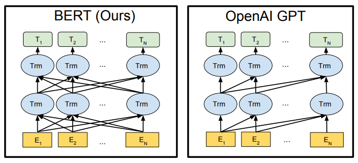
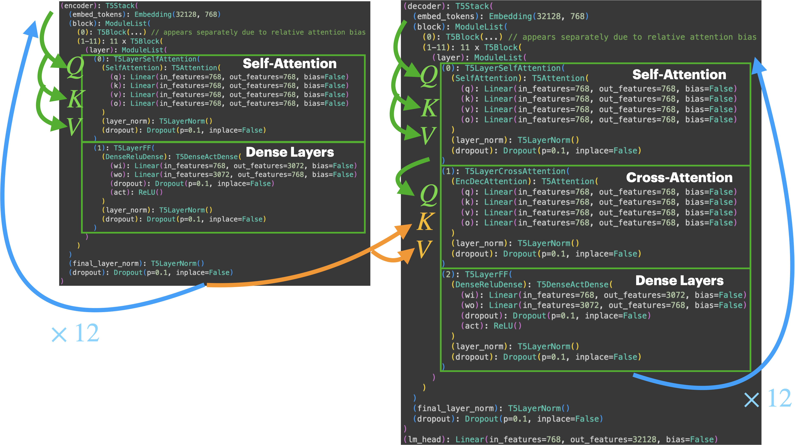
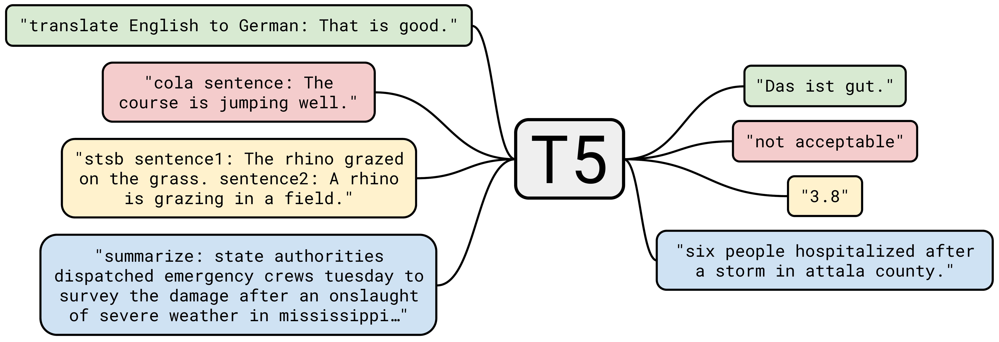

<center><a href="https://www.nvidia.com/en-us/training/"></a></center>


# <font color="#76b900">**Notebook 4:** Encoders and Decoders for Sequence Generation</font>

In the previous notebook, we explored tasks where "BERT-like" encoder-only models showed their strength in understanding static inputs. These models excel in tasks where the input does not need to be transformed or dynamically altered, such as text classification, sentiment analysis, and named entity recognition. However, their ability to generate novel or dynamic outputs is limited. 

For tasks like machine translation, summarization, and question-answering, where the output needs to be dynamically generated in a structured form, we require more complex architectures that go beyond encoding input.

In this notebook, we expand our architectural toolkit to explore **encoder-decoder** and **decoder-only** models, which are designed to generate ordered sequences based on input contexts:

- **Encoder-Decoder Models (e.g., Flan-T5)**: These models first encode the input into a fixed representation and then decode it into a new, ordered sequence. For example, in translation, the encoder understands the source sentence, while the decoder generates the translated sentence.
- **Decoder-Only Models (e.g., GPT-2)**: Unlike encoder-decoder models, decoder-only models predict tokens based on previous context and excel at tasks that where the input and output distributions blur together, such as in open-ended text generation and dialogue systems.

#### **Learning Objectives:**

- Learn about encoder-decoder models that use an encoder for static context and a decoder for generating ordered sequences.
- Understand how decoder-only models, like GPT-2, excel in generative tasks by predicting tokens based only on previous decoder contexts.


<hr>
<br>

## **Part 4.1:** The Machine Translation Task

[**Machine Translation**](https://huggingface.co/tasks/translation) is the task of automatically translating text from one language to another using software. While the term may sound straightforward, machine translation is an extremely complex task that requires models to understand and generate languages with vastly different grammar, syntax, word order, and even cultural nuances.

For instance, translating from a language like Japanese, which often places the verb at the end of the sentence, to English, which follows a subject-verb-object (SVO) structure, can be tricky. Additionally, languages often have unique idiomatic expressions and contextual meanings that must be accurately captured by the model.

### **Shifting from Encoders to Decoders**
The complexity of translation arises from the need to not just understand the source language (encoding) but also to generate a fluent and coherent translation in the target language (decoding). This is where **encoder-decoder models** shine. For natural language specifically:

- The **encoder** processes the source language sentence, turning it into a fixed representation that captures its meaning.
- The **decoder** takes this representation and generates the translated sentence in the target language, word by word.

This combination allows the model to first "understand" the meaning of a sentence before attempting to "generate" the translation. Such a structured approach leads to more accurate translations, especially in languages with drastically different sentence structures.

However, for other generative tasks, like creating open-ended text or dialogues, we can bypass the need for a fixed input representation and instead rely on a model that generates outputs one token at a time. This leads us to the next section, where we explore **decoder-only** models like GPT-2, which are designed for these more open-ended tasks.


<hr>
<br>

## **Part 4.2:** Pulling In A GPT-style model

As we’ve discussed, architectures like BERT are excellent for understanding input data but fall short when it comes to generating text. For tasks that require the generation of novel sequences—whether it's storytelling, dialogue, or open-ended text completion—we need a model that can predict and generate tokens sequentially. This is where the **GPT-style architecture** prevails.

#### **Why Decoder-Only Models?**
GPT-2 is an example of a **decoder-only** model, which is designed for **autoregressive text generation**. Unlike encoder-decoder models, which use a separate encoder to understand the input, decoder-only models generate text one token at a time. The model is trained to predict the next token in a sequence based on the previous ones, a process known as **autoregression**.

#### **How Does Autoregressive Generation Work?**
1. The model is given an initial prompt like `"Hello world,"`.
2. It predicts the most likely next token based on the prompt.
3. The predicted token is added to the input sequence, and the process is repeated until the model generates a complete output.

This method allows the model to generate open-ended sequences without needing a fixed input context, making it ideal for tasks like dialogue generation, storytelling, and text completion.

**Let’s see GPT-2 in action with a simple text generation example:**


```python
from transformers import pipeline, set_seed

# Create a text-generation pipeline using GPT-2
generator = pipeline('text-generation', model='gpt2')

# Generate 5 sequences of text starting with the prompt "Hello world"
generator("Hello world,", max_length=20, num_return_sequences=5)
```


#### **Interpreting the GPT-2 Output**
When the model generates text, it’s creating novel content based on the prompt "Hello world," by predicting one token at a time. Each sequence will be different due to the probabilistic nature of the model.

- **Why 5 sequences?**: By specifying `num_return_sequences=5`, we ask the model to produce 5 variations of text. GPT-style models use atteibutes like `temperature` and `top_k`/`top_p` to modulate sampling strategy, causing results to be non-deterministic by default.
- **Max Length**: The parameter `max_length=20` limits the output to 20 tokens, which can help manage the size of generated sequences when experimenting. Before this, the model can also stop with a dedicated stop token or a manually-specified stop string. 

#### **Investigating The Forward Pass**

Going a bit below the pipeline, we can use the same principles as before to investigate how the data is actually generated:


```python
import torch

print("GENERATING ALL AT ONCE:")
input_str = "Hello world"
print(f"{(x := generator.preprocess(input_str))}")
print(f"{(x := generator.forward(x, max_new_tokens=20))}")
print(f"{(x := generator.postprocess(x))}")

#################################################################################

print("\nGENERATING ONE TOKEN AT A TIME (prep+forward+post):")
print(input_str := "Hello world", end="")
output_buffer = ""
for i in range(20):
    x = generator.preprocess(input_str + output_buffer)
    x = generator.forward(x, max_new_tokens=1)
    x = generator.postprocess(x)
    next_word = x[0].get("generated_text")[len(input_str + output_buffer):]
    output_buffer += next_word
    print(next_word.replace("\n", "\\n"), end="")

#################################################################################

print("\n\nGENERATING ONE TOKEN AT A TIME (manually, greedily-sampled):")

model_body = generator.model.transformer
model_head = generator.model.lm_head
tknzr_encode = generator.tokenizer.encode
tknzr_decode = generator.tokenizer.decode

def compute_embed(token_id):
    return model_body.wte(torch.tensor([token_id])).view(1, -1, 768)

# PREFILL stage: Processing the initial input string
print(input_str := "<|endoftext|> Hello world", end="")
embed_buffer = compute_embed(tknzr_encode(input_str))
attention_mask = torch.ones(embed_buffer.shape[:2], dtype=torch.long)
past_key_values = None

# PREFILL - running the model for the input string, getting kv cache and embeddings
prefill_output = model_body.forward(
    inputs_embeds=embed_buffer, 
    attention_mask=attention_mask,
    past_key_values=past_key_values,
)
past_key_values = prefill_output.get("past_key_values")
predicted_embed = prefill_output.get("last_hidden_state")

# DECODE stage: Start the token-by-token generation process
for i in range(100):
    predicted_probs = model_head(predicted_embed[:, -1, :])
    predicted_token = torch.argmax(predicted_probs, dim=-1).item()
    print(tknzr_decode(predicted_token), end="")

    # Update attention mask and run model with past_key_values for next token
    decode_output = model_body.forward(
        inputs_embeds=compute_embed(predicted_token), 
        attention_mask=torch.ones([1,1], dtype=torch.long),
        past_key_values=past_key_values,
    )
    predicted_embed = decode_output.get("last_hidden_state")
    past_key_values = decode_output.get("past_key_values")
```

<br>

Seeing how the system works, it *seems* like this process could all be solved with a simple $n \to 1$ encoder model repeated over and over until a max length or stop token is reached. And you would be mostly right *with one caveat*: **training inefficiency.**

Given a training example `"Hello world and all who live in it"`, an $n \to 1$ training formulation would require the following training examples:
```sh
"<CLS> Hello" -> "world"
"<CLS> Hello world" -> "and"
"<CLS> Hello world and" -> "all"
"<CLS> Hello world and all" -> "who"
"<CLS> Hello world and all who" -> "live"
"<CLS> Hello world and all who live" -> "in"
"<CLS> Hello world and all who live in" -> "it"
"<CLS> Hello world and all who live in it" -> "<PAD>"
```  

Assuming we have a regular encoder formulation with **bi-directional reasoning**, the attention would have to be fully recomputed for every new word generation. In contrast, if our attention mechanisms were only **uni-directional**, then we could have the following training formulation from just a restricted attention matrix:

```sh
INPUT="<s> Hello world and all who live in it"
         \    -\   -\   -\  -\  -\  -\  -\ -\
OUTPUT="Hello world and all who live in  it </s>"
```


**Simplified Intuition:** In general, unidirectional reasoning is better when the input sequence grows progressively, since each the input-output maps can be trained in parallel for the whole sequence. Bidirectional reasoning is better when the input sequence does not grow, since each prediction can consider its the entries before and after it. 

In common nomenclature, this attribute - or, rather, the task of next-token prediction that warrants this attribute - is the difference between **encoder** and **decoder** transformer architectures. 
> <div></div>
>
> **Source: [BERT: Pre-training of Deep Bidirectional Transformers for Language Understanding (2019)](https://arxiv.org/abs/1810.04805)**-


---

<details>
<summary><b>Math Details:</b></summary>

When setting up an autoregressive problem with the end-goal of generating some novel series $x_{a\ldots b}$ from some conditioning series $x_{0 \ldots a-1}$, we'd be generating $x_t$ at every timestep for $a \leq t \leq b$. As such:

- With uni-directional, we're modeling $P(x_{a\ldots t} \ | \ x_{0\ldots t-1})$ from some starting spot $a$ such that $P(x_{s} \ | \ x_{0\ldots s-1})$ for all $s \leq t$, so previous predictions $P(x_s)$ do not have to be recomputed for every $t$ increment. This is better when $t$ is growing, since each past generation $P(x_s)$ has a constant definition defined relative to $s$.

- With bi-directional reasoning, we'd be modeling $P(x_{a\ldots t} \ | \ x_{0\ldots t-1})$ such that $P(x_s \ | \ x_{0\ldots t-1})$ for all $s \leq t$, which would make each and every $P(x_s)$ depend on both past and future token predictions. This is better when $t$ is static, since each $P(x)$ has more information conditioning it but also has a static definition which doesn't change/require recomputation as more entries are introduced.

**NOTE:** Bi-directional reasoning is a lot more compelling when the output range is actually a different distribution - such as when we formulate $P(y | x)$ instead of $P(x_b | x_a)$ for disjoint $x$ and $y$ distributions - since our network could reuse generalizable intutions and benefit from the added training exposure. In a more grounded note, recall natural language translation where you just want your input substring translated and nothing more. 

</details>

<hr>
<br>

## **Part 4.3:** Encoders, Decoders, and Encoder-Decoders

We previously oversimplified encoders and decoders to their natural language application, so this section hopes to define the terms more generally. Within any machine learning formulation, you deal with the following types of data representations:
- **Explicit (Observed) Representation:** The form of data that is human/software interpretable.
    - i.e. actual language/encoding of language/data points that go into a model, etc.
- **Implicit (Latent) Representation:** The form of data that is optimized into existence for an end-goal.
    - i.e. intermediate representation in a multi-layered pipeline, embeddings optimized for similarity search, etc.

From that perspective, you generally interact with two kinds of macro-structures in your deep learning pipelines:
- **Encoders:** Transform input into some implicit representation with desirable properties (i.e. dimension, semantics, range, etc).
- **Decoders:** Transform input directly into some explicit representation (i.e. human/software reasonable data format).

With that said, why is BERT considered an encoder architecture? The reason is a bit historical and boils down to the following intuition:
- **If our task is to create a simple $n \to n$ or $n \to 1$ mapping**, the BERT-like architecture from before is sufficient. It can then be argued that a BERT-backed pipeline has a token-wise MLP which functions as a ***per-token/per-sequence decoder***. But that's confusing, so our previous terms of task-specific heads or classification heads are more common.
- **If our task is to generate a new $m$-sequence progressively,** the architecture is insufficient and needs a secondary ***text-generating decoder*** structure which helps to model our data in a different way.

In general, a dedicated decoder component has some property that is more conducive to generating the explicit output representation. This could be a sequence, an image, a graph, a physically-constrained system, etc. ***In this case, the point of the decoder is to be more suited for one-token-at-a-time *autoregressive* generation of outputs.***

In the original [**"Attention Is All You Need" (2017) paper**](https://arxiv.org/abs/1706.03762), the two structures were played to their presumed strengths and were combined together in a form of "conditioned decoding" that uses the bidirectional reasoning of one sequence to help generate another sequence with unidirectional one-token-at-a-time generation. The strategy that they use is called **cross-attention**, which is simply attention that factors components from two sequences together. 

**The end result is an architecture that has two key functionalities:**
- Generate token after token autoregressively from the decoder architecture, where each new generated token is included in the input for predicting the one after it.
- Frequently inject context from the encoder to the decoder, making sure the generation stays in line with the overall objective.

---

<details>
<summary><strong>Math Details:</strong></summary>

We can show that the attention mechanism from the last notebook can be used to take in both an $n$-element and $m$-element sequence if we select out inputs properly. Consider the case when you have queries/values $K_{1..m}$/$V_{1..m}$ coming from the encoder and keys $Q_{1..n}$ coming from the decoder.

> 
- If $K_i$ and $Q_i$ have the same embedding dimension, then $Q_iK_i^T$ is an $n\times m$ matrix, as are that matrix's softmax values. In other words:
 $$\text{Attention}(K_{1..m}, Q_{1..n}) \text{ is } n\times m.$$

- Since $V_{1..m}$ is of dimension $m \times d$ and therefore is multiplicatively compatible with an $n\times m$ attention matrix:
 $$\text{Attention}(K_{1..m}, Q_{1..n}) V_{1..m} \text{ is } n\times d$$

- Since $\text{Attention}(K_{1..m}, Q_{1..n}) V_{1..m}$ and $\text{Attention}(K_{1..n}, Q_{1..n}) V_{1..n}$ are of the same dimension, both can be used interchangeably and/or in series.

Therefore, we can use an attention interface to incorporate an $m$-element sequence as context for an $n$-element sequence! Just do that many times over, and you have strong context-driven generation.
</details>

<hr>
<br>

## **Part 4.4:** Machine Translation with T5-style Encoder-Decoders

Since the original 2017 paper, the prominence of the combined encoder-decoder architecture has waned in and out of popularity on a per-application basis. **The use-cases that have remained encoder-decoder-dominant are those where the following criteria are met:**

1. **The problem requires reasoning from at least two sequences with potentially-differing lengths.**
    - If they're the same length or the output is a strict subset, then an $n \to n$ mapping with an encoder is sufficient.
2. **The problem requires you to progressively generate or continue at least one sequence.**
    - If the input sequence does not grow, then an $n \to 1$ mapping with an encoder is sufficient.
3. **The sequences follow disjoint distributions (formats, purposes, modalities, etc).**
    - If they follow the same distribution, it's better to feed them both through the same network pathway.
4. **The model needs to be lightweight and task-specific for training and/or performance.**
    - If the model is allowed to be general/multipurpose, we could feed both sequences through the decoder pathway. *More on that later.*

Coincidentally, high-speed machine translation is still one such application:


```python
from transformers import pipeline

translator = pipeline('translation_en_to_fr', model='t5-base', device="cuda")
translator(["Hello World! How's it going?", "What's your name?"])
```

Notice that this problem meets all of our requirements:
- The translation of a passage is neither inherently $n \to n$ nor $n \to 1$.
- The output needs to be generated one token at a time while being a cohesive sequence.
- The two languages likely follow fundamentally different distributions.
- The model should be fast, lightweight, and inherently limited in purpose, with flexibility being a secondary concern. 

#### Preprocessing and Postprocessing

We can investigate where the model begins and ends to get some insight into how it works:


```python
text_en = "Hello World! How's it going?"
resp_fr = translator(text_en)
text_fr = resp_fr[0]['translation_text']

tknzr = translator.tokenizer
tokens_ins = [tknzr.decode(x) for x in tknzr.encode(text_en)]
tokens_in2 = [tknzr.decode(x) for x in translator.preprocess(text_en)['input_ids'][0]]
tokens_out = [tknzr.decode(x) for x in tknzr.encode(text_fr)]
print(f"Inputs Into Preprocessing: {' | '.join(tokens_ins)}")
print(f"Inputs Into Model Forward: {' | '.join(tokens_in2)}")
print(f"Output From Model Forward: {' | '.join(tokens_out)}")
```

**On observation, we can see that:**
- The model uses the same tokenizer for both input and output language.
- The proprocessing pipeline adds extra task instructions to explain the task.

This is because the T5 model on its own was trained for multiple tasks, and the en2fr translation task is merely one of its objectives. A custom-made model may or may not train for tasks outside of its immediate objective, but doing so does help the model learn transferable intuitions. Depending on the training/architecture details and learning capacity:

- **The model *could* be overloaded**, unable to latch on to the multi-task formulation and experiencing degredation or overfitting. 
- **The model *could* learn a reasonable language prior**, leveraging the shared structure of the tasks and instructions to make further fine-tuning easier and quicker.
- **The model *could* generalize beyond its original training** with the ability to reason about new instructions, solve novel tasks, and make non-trivial connections. In other words, exhibiting emergent behaviors like **in-context learning**.

#### Encoder-Decoder Forward Pass

We can investigate this architecture further by displaying the model descriptions, but you'll notice they're quite verbose. We've synthesized them here for ease of viewing:

```python
translator.model           ## See that there's a lot of stuff going on here
translator.model.encoder   ## See that this looks a lot like the BERT model
translator.model.decoder   ## See that this looks roughly the same and wonder what changed
```

<div></div>

Recall that in the previous forward pass deconstructions, it was pretty easy to exhibit the following properties: 
- We could manually specify the inputs on a per-component basis by investigating the model definitions.
- We could stream generation by repeating the forward pass one token at a time, accumulating the results in a buffer and modifying/printing things as necessary.

In this section, we will repeat the process again but modularize it into a **stream generator** format for easy of use. The goal here is to have a system that feeds back the generated tokens - effectively hiding the complexity therein - while allowing the user to iterate over and customize the results as soon as they come in. 


```python
import torch

def get_token_generator(pipeline, model=None, tokenizer=None, max_tokens=50):
    
    ## This method initializes a generator which will yield a stream of tokens
    model = pipeline.model or model
    tknzr = pipeline.tokenizer or tokenizer
    encoder = getattr(model, "encoder", None)
    decoder = ( ## Non-exhaustive resolution
        getattr(model, "decoder", None) 
        or getattr(model, "model", None) 
        or getattr(model, "transformer", None)
    )
    lm_head = getattr(model, "lm_head", None)
    dev = decoder.device
    
    def token_generator(
        encoder_input: str = "",
        decoder_input: str = "",
        max_tokens: int = max_tokens
    ):
        encoder_input_idxs = tknzr.encode(encoder_input)[:-1] * bool(encoder_input)
        decoder_input_idxs = tknzr.encode(decoder_input)[:-1] * bool(decoder_input)
        decoder_inputs = {}

        ## [EncDec] Convert our context into conditioning hidden state for decoder
        if encoder:
            encoder_inputs = {"input_ids": torch.tensor([encoder_input_idxs], device=dev)}
            encoder_outputs = encoder(**encoder_inputs)
            decoder_inputs["encoder_hidden_states"] = encoder_outputs.last_hidden_state
        elif encoder_input_idxs:
            print("`encoder_input` specified despite no encoder being available. Ignoring")
            
        ## [EncDec/Dec] Accumulate decoding starting from <pad> until </s> (eos) is reached.
        buffer_token_idxs = [] if (tknzr.pad_token_id is None) else [tknzr.pad_token_id]
        buffer_token_idxs += decoder_input_idxs
        buffer_token_str = ""
        max_length = len(buffer_token_idxs) + max_tokens
        while len(buffer_token_idxs) < max_length:
            
            ## Pass the current buffer into the decoder, along with encoder states
            ##   NOTE: This one just uses the last hidden state, but some use many more...
            
            decoder_inputs["input_ids"] = torch.tensor([buffer_token_idxs], device=dev).long()
            decoder_outputs = decoder(**decoder_inputs)
            model_outputs = lm_head(decoder_outputs.last_hidden_state)
        
            ## Get the most likely next token and add it to the buffer
            try: sampled_token_idx = torch.argmax(model_outputs, -1)[0][-1].item()
            except: break
            buffer_token_idxs += [sampled_token_idx]
            buffer_token_old = buffer_token_str
            buffer_token_str = tknzr.decode(buffer_token_idxs)
            buffer_token_new = buffer_token_str[len(buffer_token_old):]

            ## Yield (output while keeping spot in the generator call) next token.
            ## If it's end-of-string </s>, break the loop.
            if sampled_token_idx == tknzr.eos_token_id:
                break
            if buffer_token_new:
                yield buffer_token_new
    
    return token_generator

###############################################################################

streamer = get_token_generator(translator)
input_raw_str = "translate English to French: Hello World! How's it going?</s>"

for token in streamer(encoder_input = input_raw_str):
    print(token, end="|")
```

<br>

## **Part 4.5:** Creating More General-Purpose Models

Recall our assumptions about when to use encoder-decoders, and focus in on 3 and 4.  

1. The problem requires reasoning from at least two sequences with potentially-differing lengths.
2. The problem requires you to progressively generate or continue at least one sequence.
3. **The sequences follow disjoint distributions (formats, purposes, modalities, etc).**
    - If they follow the same distribution, it's better to feed them both through the same network pathway.
4. **The model needs to be lightweight and task-specific for training and/or performance.**
    - If the model is allowed to be general/multipurpose, we could feed both sequences through the decoder pathway.
  
With this in mind, let's pull in an encoder-decoder model which attempts to be less lightweight and more general: [**Google's Flan-T5 class of models**](https://huggingface.co/docs/transformers/en/model_doc/flan-t5).


```python
from transformers import pipeline

flan_t5_pipe = pipeline("text2text-generation", model="google/flan-t5-large")

streamer = get_token_generator(flan_t5_pipe)
input_raw_str = "translate English to French: Hello World! How's it going?</s>"

for token in streamer(encoder_input = input_raw_str):
    print(token, end="")
```

Given these, let's list out the possible options. Let's assuming we have an encoder-decoder formulation with premise $P$, question $Q$, and answer $A$. The T5 model is advertised to reason about it as follows: 

> `Encoder("{P}: {Q}")` conditions the generation of `Decoder("<pad>")`, which itself is optimized to produce the answer $A$ by generating one token at a time until the stop token is reached.

This format has been reinforced through significant pretraining by formatting the training data to subscribe to this format. This results in a strong **inductive bias** (or **prior**) to understand and respect the format.

> <div></div>
>
> **Source: [Exploring the Limits of Transfer Learning with a Unified Text-to-Text Transformer](https://arxiv.org/abs/1910.10683v4)**

Furthermore, the Flan version of the T5 model is further trained with more complex tasks so that the model may generalize beyond its trained objective towards **in-context learning**, which is the ability to solve novel tasks merely by being told what to do as part of the context.

> <div></div>
>
> **Source: [Scaling Instruction-Finetuned Language Models](https://arxiv.org/abs/2210.11416v5)**

To test out these capabilities, we can create a simple dataset of questions that we'd like to test our model against in a sort of **evaluation process**. See how it performs, and see if you can't implement the exercise TODOs at the end.


```python
dataset = [
    {   # Simple Translation
        "premise": "Translate from English to Spanish",
        "question": "The book is on the table.",
        "answer": "El libro está en la mesa.",
        "few_shot": {
            "question": "The cat is sleeping on the sofa.",
            "answer": "El gato está durmiendo en el sofá."
    }},{# Commonsense Reasoning
        "premise": "Answer the question using commonsense knowledge",
        "question": "Why can't a fish live out of water?",
        "few_shot": {
            "question": "Why can't humans breathe underwater?",
            "answer": "Humans can't breathe underwater because they need air, not water, to fill their lungs."
    }},{# Creative Story Generation
        "premise": "Continue the story with a creative twist",
        "question": "Once upon a time, in a forest far away, there was a small bear named Timmy who loved honey.",
        "few_shot": {
            "question": "A princess woke up one day to find her castle floating in the sky.",
            "answer": "As she looked outside, she saw a giant eagle carrying the castle on its back, flying towards the mountains."
    }},{  # Mathematical Problem Solving
        "premise": "Solve the mathematical problem",
        "question": "What is the square root of 144?",
        "few_shot": {
            "question": "What is the cube of 3?",
            "answer": "27."
    }},{# Fact-based Question Answering
        "premise": "Answer based on factual knowledge",
        "question": "Who was the first person to walk on the moon?",
        "few_shot": {
            "question": "Who was the first president of the United States?",
            "answer": "The first president of the United States was George Washington."
    }},{# Conversational Continuation
        "premise": "Continue the conversation naturally",
        "question": "User: Can you help me with directions? Agent:",
        "few_shot": {
            "question": "User: What’s the weather like today? Agent:",
            "answer": "It’s sunny and warm with a light breeze."
    }},{# Conversational Continuation
        "premise": "Continue the conversation naturally",
        "question": (
            "User: Can you help me with directions? Agent: Sure, where to and where from?"
            " User: I'd like to get from LA to San Jose today. What's the best road? Agent: "
        ),
        "few_shot": {
            "question": "User: What’s the weather like today? Agent:",
            "answer": "It’s sunny and warm with a light breeze."
    }}
]

streamer = get_token_generator(flan_t5_pipe)

for entry in dataset:
    P, Q = entry['premise'], entry['question']
    FSP, FSQ = entry['few_shot']['question'], entry['few_shot']['answer']
    inputs = {
        "encoder_input": f"{P}: {Q}</s>",
        "decoder_input": "",
        # "encoder_input": f"{P}: ",
        # "decoder_input": f"{FSQ}? {FSA}</s>{Q}? ",
    }
    print(f"{P}: {Q}")
    for token in streamer(**inputs):
        print(token, end="")
    print("\n")

## EXERCISE 1: Incorporate Few-Shot (in this case just one-shot) conditioning.
## EXERCISE 2: Remove the encoder from the equation and progress towards in-context learning.
```

<br>

You'll notice that the base Flan-T5 model is a solid alright-at-best in terms of consistent text generation and pretty poor in terms of out-of-the-box utility. **The real use-case that the T5 family excels at is task-specific fine-tuning:**
- Because the models are actually pretty small, they're fairly straight-forward to fine-tune.
- Because the encoder has already been fine-tuned with a variety of natural-language, it serves as a base model which can start reasoning about a new input format with relatively few gradient updates if it shares features with one of the heavily pre-trained tasks. 
- Because the decoder is only there to generate a novel sequence (and not necessarily reason about context that comes from a disjoint distribution like a question or premise), it experiences relatively little autoregressive drift and is less likely to derail.

Having said that, there are some much-desired features which are less natural with this formulation:
- Few-shot prompting being handled from the encoder is more cumbersome and requires the encoder to handle both input-like and output-like data distributions.
- At the same time, the decoder overall has less training data to work with due to bifurcation between the two pathways.

#### Swapping to a Decoder-Only Model

We previously tried out the GPT-2 model to illustrate how decoder-only models function. It wasn't very good, which makes sense since it was an early model primarily suited for fine-tuning workflows. Decoder models that don't derail tend to require larger architectures, but a class of smaller decoder-only models have emerged for fine-tuning purposes. This class of models is often referred to as SLMs (Small Language Models) and retroactively includes most of the T5 models above. 

For our exercise, we are going to pull one of Microsoft's smallest Phi SLMs, [**Phi-1.5**](https://huggingface.co/microsoft/phi-1_5). Much like the Flan-T5 above, we will once-again bypass several of the required customizations necessary to make this system work for actual use-cases, mainly:
- We will not be fine-tuning it for our purposes.
- We will subscribe to the recommended format, but will not perform early stopping/extensive prompt engineering.
- We are once again using an out-of-the-box model from over a year ago.


```python
decoder_pipe = pipeline("text-generation", model="microsoft/phi-1_5", stop_token="\n", device="cuda")
# decoder_pipe = pipeline("text-generation", model="gpt2", stop_token="\n")
streamer = get_token_generator(decoder_pipe)

for entry in dataset:
    P, Q = entry['premise'], entry['question']
    FSP, FSQ = entry['few_shot']['question'], entry['few_shot']['answer']
    inputs = {
        "decoder_input": f"{P}: {Q}\n\nAnswer: ",
    }
    print("*" * 64)
    for token in streamer(**inputs):
        print(token, end="")
    print("\n")

## EXERCISE: Incorporate Few-Shot (in this case just one-shot) conditioning.
```

<br>

As you can see, this model has an entirely different set of pros and cons. **Specifically, it's actually being flexible and facilitating all of these new premises all through a single input pathway, while having more issues attributed to run-on generation in contrast to complete inability to generalize!** 

This emergent behavior of **in-context learning** and is the main enabler of the [**prompt engineering**](https://en.wikipedia.org/wiki/Prompt_engineering) paradigm which will be further discussed in Notebooks 6 and 7!

<hr>
<br>

# <font color="#76b900">**Wrapping Up**</font>

At this point, we've seen how language models are able to generate completely new text by taking a language encoding as context. This opens up a lot of new possibilities and leaves open a lot of open questions, but at least we're now at the cutting edge and have the capacity to do some pretty powerful stuff with limited compute budget! In the next section, we're going to see a use case for which encoder-decoders really shine; **multi-modal generation**.


```python
## Please Run When You're Done!
import IPython
app = IPython.Application.instance()
app.kernel.do_shutdown(True)
```

<center><a href="https://www.nvidia.com/en-us/training/"></a></center>
