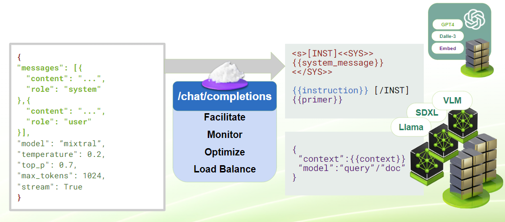
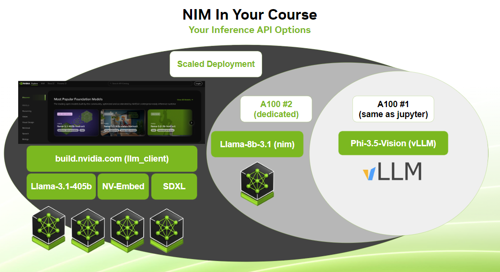
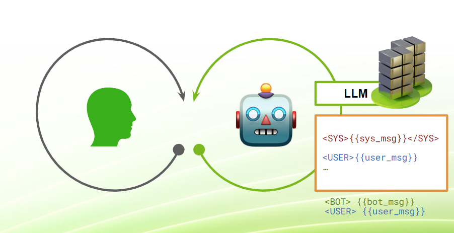

<center><a href="https://www.nvidia.com/en-us/training/"></a></center>

# <font color="#76b900"> **Notebook 6:** Introduction To GenAI Servers</font>

In Notebook 4, we motivated and constructed the decoder and encoder-decoder models to enable non-trivial generative systems. We further reinforced them in Notebook 5 with a shift towards multimodal contexts, which extended towards new representations and architectures. In this notebook, we will shift our attention back towards text generation and address the need to exhibit more powerful capabilities and deploy our models for others to use.

#### **Learning Objectives:**
- Recognize the limitations of basic generative models in production environments.
- Understand the concept and advantages of **LLM and GenAI Servers**.
- Learn how to deploy and interact with a **vLLM HuggingFace Model Server**.
- Explore methods for **efficient and concurrent inference** with server deployments.
- Discover techniques for optimizing LLM deployments using **NVIDIA NIM** for real-world use.
- Gain an introduction to **LLM orchestration using LangChain**, which will be fleshed out further in the following notebook.

<hr>
<br>

## **Part 6.1:** Scaling Models To Real-World Use-Cases

Though we've had a good time exploring the underlying intuitions and basic structure of foundational GenAI backbones, there are several key limitations keeping us away from a production-ready application.

> #### **Our generative models are underpowered.**
> 
> Since we're bound to our environment's resources and want to survey a variety of components, we've had to limit ourselves to smaller general systems and niche problem formulations to showcase the power of GenAI architectures. Some of them, including some narrowly-scoped encoder and encoder-decoder models, are actually capable of performing non-trivial real-world tasks in some contexts. However, so far none of our models have been sufficient for non-trivial text generation and instruction following out of the box.

> #### **Our inferences are inefficient.**
> 
> Since we've been focusing on the methods and intuitions, we've been happy enough to just understand what's going on and see that the process runs as expected. This is not sufficient for real-world contexts where speed is important and multiple processes have to chain together to deliver a satisfactory experience. Furthermore, it's not a good use of resources to leave performance on the table.

> #### **Our deployments are single-user single-instance.**
>
> We've been happy to rely on our exclusive access to these models to showcase their inner pipeline definitions and observe what's really going on. However, all of the deployments so far have been quarantined inside your Jupyter notebook environments and grant exclusive access to the compute and deployment. This level of access and control cannot scale to large user bases since individual spin-up is expensive and shared access to a Python object is hard to manage.

Throughout this notebook, we will explore the use of **Inference Servers** to deploy and access more general decoder-style models capable of complex tasks like arbitrary instruction following and conversation.

<hr>
<br>

## **Part 6.2:** Accessing Your First LLM Server

Throughout the rest of the course, you'll be able to interact with three different LLM server deployments that span different scales and considerations. To start, let's introduce our lightest option and explore its functionality.

### **vLLM HuggingFace Model Server** 

[**The vLLM Project (short for virtual Large Language Model)**](https://github.com/vllm-project/vllm) is a popular open-source LLM serving project that supports a variety of HuggingFace models. Once configured to serve a model of choice, a vLLM server will:

- Download or cache-load the model and relevant configurations into an accessible directory.

- **[Optionally]** Convert the model cache into a more optimized form, e.g., with lower-precision weights.

- Load the model into a differentiable pipeline based on the downloaded configuration.

- **[Optionally]** Replace parts of the pipeline with more optimized interfaces (e.g., fused components that function similarly but perform faster in the forward pass).

- **Create and expose connection routes to access the model in a standard, independent, and scalable fashion.**
    - **Standard:** The interface should be well-defined and shared across a class of similar models. This allows users to swap between different models and create connectors that can sit on the client side and operate reliably.
    - **Independant:** The interface should not behave differently when it is being used by other users (unless necessary, e.g., slowing down with load). While stateful systems can be made and some caching and optimizations may be implemented, most starting GenAI server configurations aim for statelessness.
    - **Scalable:** The interface should assume multiple processes might be using its endpoints at a time and should make an effort at preserving the user experience and — at minimum — avoid catastrophic failure.
 
**[TODO]** To get started, please check out [**98_VLM_Launch.ipynb**](./98_VLM_Launch.ipynb) and execute the kickstart cell. This will load a **Visual Language Model (VLM)** from HuggingFace - namely [**Microsoft's Phi-3.5-vision-instruct model**](https://huggingface.co/microsoft/Phi-3.5-vision-instruct) - and deploy it to a server. After the kickstart, the server should be accessible from any notebook through a port interface.
- **Why is it in another notebook?** The server needs its own event loop to continue operating in the background. Managing multiple event loops inside a Jupyter notebook's Python kernel can be overly cumbersome. By using a separate notebook, we can dedicate its kernel solely to running the server, ensuring smooth operation without interfering with our main notebook's execution.


```python
## RUN THIS LINE TO LOCK IN SOME VARIABLES FOR LATER, INCLUDING SOME USED BY DEFAULT IN SOME CONNECTORS
model_path="http://localhost:9000/v1"
%env NVIDIA_BASE_URL=$model_path
%env NVIDIA_DEFAULT_MODE=open
```


```python
import requests

## Send a GET request to the LLM server port that lists the available models
model_discovery = requests.get(f"{model_path}/models").json()
model_name = model_discovery.get("data", [{}])[0].get("id")
model_discovery
```

### **Calling The LLM**

Now that we have our model deployed and have confirmed that the server is live, we can try to query it for some inference! This server is deployed to largely follow the [**OpenAI inference API schema**](https://platform.openai.com/docs/guides/text-generation) which is quite standard in the ecosystem. As such, our first approach should be to use an off-the-shelf connector.

We could use a raw client like the official [**`OpenAI` python client**](https://github.com/openai/openai-python). This is made to connect to a class of server deployments in a relatively transferable fashion and can be called from a variety of other frameworks as a basic calling unit.


```python
import os
from openai import OpenAI

client = OpenAI(
    base_url=model_path,
    api_key="None",
)

client.completions.create(
    prompt="Hello! How's it going",
    model=model_name,
)
```

Alternatively, we could also use a connector that sits on top of a base client and instills additional assumptions and functionality. Its purpose may be to simplify a base client's workflow towards a particular use case or interact more naturally with other frameworks. In this course, we will be using [**LangChain**](https://www.langchain.com) in the next notebook and will benefit from the utilities of [**NVIDIA's LangChain connector, ChatNVIDIA**](https://python.langchain.com/docs/integrations/chat/nvidia_ai_endpoints/), so let's start to get comfortable with it: 


```python
from langchain_nvidia_ai_endpoints import ChatNVIDIA

llm = ChatNVIDIA(
    model=model_name,
    max_tokens=4096,
)

print(repr(llm.invoke("Hello! How's it going")))
```

Having called the server through two different endpoints, you may have noticed a difference in the result: **OpenAI's completions request gave you a continuation of the sentence, but `ChatNVIDIA` gave you a chat-like response.** This is because the two connectors are calling different server endpoints that function differently. Under the hood, `ChatNVIDIA` defaults to sending the input to the `/chat/completions` endpoint and provides a `messages` argument instead of the `prompt` argument as seen above:


```python
llm._client.last_inputs
```

This applies a chat template to the input before feeding it to the LLM. This format is provided specifically because it was reinforced during training through **instruction fine-tuning** and **synthetic data generation**. Templates can be modified to create arbitrary styles and accept arbitrary message types, but some typical components include:
- **System Message:** An overall directive that does not follow a chat format and outlines intended behavior. Directives specified in this format are usually strongly reinforced during training and have a strong influence over the model's performance.
- **Human Message:** These are chat-style or instruction-style messages intended to instruct an LLM. They are usually complemented by (or possibly overpowered by) the system message and are likely the mode through which end-users communicate with an LLM-powered product.
- **AI Message:** These usually follow the human message and can either be generated by an LLM or serve as representative filled-in examples for **few-shot prompting**.

Given a series of messages, the actual input to your model can be seen below:


```python
from jinja2 import Environment, FileSystemLoader

env = Environment(loader = FileSystemLoader('.'))
template = env.get_template('phi35.jinja')
output = template.render(
    messages = [
        {"role": "user", "content": "Hello! How's it going"}  ## Comment out to see longer-form
    ] or [
        {"role": "system", "content": "System Instruction"},
        {"role": "user", "content": "Hello! How's it going?"},
        {"role": "assistant", "content": "Very good! How about you?"},
        {"role": "user", "content": "Life is good!"},
    ], 
    add_generation_prompt=True
)
print(output)
```

As a result, the LLM responds in a conversational way because that's what it was trained to do. Hence why the "/chat/completions" interface yields a "chat.completion" response like the one below:


```python
## OPTIONAL: Send the request directly through the requests POST interface
requests.post(**{
    **llm._client.last_inputs, 
    ## OPTIONAL: Changing the messages to for a multi-turn example
    # "json" : {**llm._client.last_inputs["json"], "messages": [
    #     {"role": "system", "content": "Please be a helpful assistant."},
    #     {"role": "user", "content": "Tell me about cats!"},
    #     {"role": "assistant", "content": "Cats are cool! Too cool for school!"},
    #     {"role": "user", "content": "How about dogs?"},
    # ]}
}).json()

# llm._client.last_response.json()
```

<div></div>

### **Passing In An Image**

Recall from the multimodal exercise that we alluded to decoder-only visual language models which project images into the input space of a text decoder. We mentioned these were generally bigger and require special training to function well, and it turns out this model is one such model. Regardless of how exactly the developers implemented this, they subscribe to the [**OpenAI Vision API**](https://platform.openai.com/docs/guides/vision) to make the model operate well within the larger ecosystem. As such - and boiling it down to the requests POST call level - we can invoke this model-specific capability with the following format:


```python
import requests
import base64

invoke_url = "http://localhost:9000/v1/chat/completions"
stream = False

with open("./img-files/paint-cat.jpg", "rb") as f:
  image_b64 = base64.b64encode(f.read()).decode()

headers = {
    "Authorization": "Bearer $API_KEY_REQUIRED_IF_EXECUTING_OUTSIDE_NGC",
    "Accept": "text/event-stream" if stream else "application/json"
}

payload = {
    "model": 'microsoft/phi-3.5-vision-instruct',
    "messages": [
        {'role': 'system', 'content': 'Please describe this picture.'},
        {'role': 'user', 'content': [
            {'type': 'image_url', 'image_url': {'url': f'data:image/jpeg;base64,{image_b64}', 'detail': 'low'}}
        ]},
    ],
    "max_tokens": 512,
    "temperature": 0.20,
    "top_p": 0.70,
    "stream": stream
}

response = requests.post(invoke_url, headers=headers, json=payload)

if stream:
    for line in response.iter_lines():
        if line:
            print(line.decode("utf-8"))
else:
    print(response.json())
```

<br>

This brings up several interesting questions: 

#### **The prompt template doesn't seem to support images! How are they getting passed in?** 

Actually, the prompt template doesn't *"not"* support images. As far as the server sees it, the content of the user message is a list of dictionaries. However, the tokenizer and embedder take care of it, processing the image and projecting it into the LLM input space. As this is all hidden behind the standard interface, this inference server can interoperate with the likes of [**OpenAI's GPT-4o**](https://openai.com/index/hello-gpt-4o/), [**NVIDIA's NVLM**](https://arxiv.org/abs/2409.11402), and the open-sourced [**Llama 3.2 (2024)**](https://ai.meta.com/blog/llama-3-2-connect-2024-vision-edge-mobile-devices/) models despite their implementation differences.

#### **The VLM has a lot of trouble when no image is provided. Is it *hallucinating*?** 

Hallucination refers to incorrect and unpredictable generation caused by a variety of issues. It most often happens because of some combination of the following:
- **The model's inputs or generations fall outside of the training/fine-tuning distribution.**
    - This can include overly-long inputs, overly-complex instructions, poorly-sampled outputs, or conflicting instructions/formats.
- **The model is not provided with enough information to make a reasonable decision.**
    - This includes insufficient instructions or lack of context to produce a coherent response.
 
In this case, asking about an image without providing one pushes the model's inputs outside of its training/fine-tuning domain, and the response ends up being nonsensical. Extra efforts could have been made to fine-tune the model to understand the lack of image inputs at a meta-level, but also extra effort could have been given on the client-side or even server-side to prevent such an out-of-distribution (OOD) event from happening.

<hr>
<br>

## **Part 6.3:** Enabling Fast Concurrent Processes

One of the surface-level benefits of having an inference server is the ability to easily connect from a variety of contexts through a lightweight interface. We see this in connecting via our port interface and can assume the process is similarly simple from other contexts. On a more subtle note, the connections we make are largely independent and non-blocking, allowing many users and applications to connect to our server at the same time.

### Concurrency with vLLM

To illustrate this, note how we can generate a very simple stream in the same way as our previous decoder streaming example from Notebook 4, which yields response chunks (one or more tokens) as soon as they get generated:


```python
from langchain_nvidia_ai_endpoints import ChatNVIDIA

llm = ChatNVIDIA(
    model=model_name,
    max_tokens=4096,
)

for chunk in llm.stream("Tell me about birds! A few sentences please."):
    # print(repr(chunk))
    print(chunk.content, end="")
```

<br>

This is a useful interface for real-time applications, and its implementation in a single-user context has already been illustrated. However, this exact behavior can be invoked from multiple instances at the same time with relatively little impact on performance.


```python
from aiostream.stream import merge as stream_merge
from IPython.display import clear_output

streams = [
    llm.astream("Tell me about fish! One sentence please.", max_tokens=100),
    llm.astream("Tell me about birds! 1 paragraph please.", max_tokens=300),
    llm.astream("Tell me about dogs! 3 paragraphs please.", max_tokens=500),
    llm.astream("Tell me about cats! 5 paragraphs please."),
]
buffers = {}
async with stream_merge(*streams).stream() as streamer:
    async for chunk in streamer:
        buffers[chunk.id] = buffers.get(chunk.id, "") + chunk.content.replace("\n", " ")
        clear_output(wait=True)
        for buffer in buffers.values():
            print(buffer, end="\n\n")
```

<br>

Not only can separate buffers generate and yield their results independently, but the requests can come in at variable times due to a mechanism called in-flight batching, which allows both pre-fill or autoregressive calls to distribute among a set of active threads with smoothed-out priority.


```python
from langchain_nvidia_ai_endpoints import ChatNVIDIA
from tqdm.auto import tqdm
import asyncio

llm = ChatNVIDIA(
    model=model_name,
    max_tokens=128,
)

topics = [
    "birds", "cats", "dogs", "lizards", "hamsters", "dragons", 
    "fireworks", "GPUs", "happiness", "sadness", "42", "24", "infinity",
    "elephants", "snakes", "rabbits", "stars", "planets", "oceans",
    "mountains", "clouds", "rain", "sunshine", "snow", "ice",
    "trees", "flowers", "rivers", "lakes", "forests", "deserts",
    "music", "dance", "art", "technology", "science", "history",
    "poetry", "philosophy", "love", "fear", "adventure", "solitude",
    "friendship", "chaos", "order", "energy", "time", "space",
]

# Creating a list of tasks for asynchronous execution
tasks = [llm.ainvoke(f"Tell me about {topic}! 100 words!") for topic in topics]

# Processing tasks with a progress bar
async for task in tqdm(asyncio.as_completed(tasks), total=len(tasks)):
    response = await task
    print(response.content[:84].strip(), end="...\n")
```

<br>

### Further Optimizing Our Deployments

We can see that with our simple vLLM deployment, we're already able to achieve reasonable inference speeds for a non-trivial number of concurrent tasks. For an individual developer or even several active users, a model of this size is more than enough for a selection of tasks. However, our deployment leaves plenty of room for improvement with regard to scaling across users, model sizes, and task complexities. Specifically, there are several levers that we have not touched:

- **Quantization:** Reducing the precision of the model's weights from floating-point to integer values can significantly decrease memory usage and increase inference speed. This is particularly beneficial for deployment on edge devices or environments where computational resources are limited but requires quantization processes which may take some time and benefit from certain hardware assumptions.
- **Inference Settings:** Fine-tuning deployment parameters like deployment/inference modes, layer fusion settings, and resource allocations allow you to trade flexibility and feature sets depending on your particular use cases.
- **Framework Optimizations:** Analyzing your current system and picking the fastest frameworks available for your deployment platform should be done to maximize the efficiency of your overall setup.

The point of these levers is to trade off between speed, concurrency, and flexibility within a given budget and adapt your setup for expected real-world workloads. However, since our environment is one of many possible configurations and may not be representative for your use cases or budgets, we will forego manual vLLM quantization and configuration and will instead include a running NIM microservice to complement the environment.

Specifically, we'll be using the **Llama-3.1-8B model** as a default decently-sized LLM model. This service was kickstarted as part of your Jupyter environment spin-up and is preemptively optimized for deployment on this system and systems like it out-of-the-box.


```python
## USE THIS ONE FOR GENERAL USE AS A SMALL-BUT-PURPOSE CHAT MODEL BEING RAN LOCALLY VIA NIM
from langchain_nvidia_ai_endpoints import ChatNVIDIA
model_path="http://nim:8000/v1"
model_name = requests.get(f"{model_path}/models").json().get("data", [{}])[0].get("id")
%env NVIDIA_BASE_URL=$model_path

llm = ChatNVIDIA(
    model=model_name,
    max_tokens=4096,
)

for chunk in llm.stream("Tell me about birds! A few sentences please."):
    print(chunk.content, end="")
```

While the test case may not show it, this model should show some significant improvement in **long-context reasoning**, **non-trivial chat interactions**, and **format-preserving instruction following** which will be explored later.

<br>

### Working Beyond Our Environment

Throughout this course, you may find that your on-device LLM options aren't sufficient for certain interesting tasks. For this reason, we will also provide access to an external API server so that you can experiment with some larger model configurations. For this service, you will be able to connect to certain models in [**`build.nvidia.com`**](https://build.nvidia.com/explore/discover), which itself hosts instances of NVIDIA NIMs deployed on an autoscaling cluster. Of especial interest may be the `meta/llama-3.1-70b-instruct` and `meta/llama-3.1-405b-instruct` models, which should exhibit a decent performance bump above your on-board 8B configuration. 

<div></div>

Note that since the [**`build.nvidia.com`**](https://build.nvidia.com/explore/discover) endpoints are shared across a pool of users and are meant for trial usage, some of the models may occasionally slow down. This slowdown should be limited to each individual model deployment, so feel free to try another model from the list if such an event occurs.


```python
# ## USE THIS ONE FOR ACCESS TO CATALOG OF RUNNING NIM MODELS IN `build.nvidia.com`
model_path="http://llm_client:9000/v1"

import requests

model_name = requests.get(f"{model_path}/models").json().get("data", [{}])[0].get("id")
%env NVIDIA_BASE_URL=$model_path
%env NVIDIA_DEFAULT_MODE=open

if "llm_client" in model_path:
    %env NVIDIA_MODEL_NAME=meta/llama-3.1-405b-instruct
else:
    %env NVIDIA_MODEL_NAME=$model_name

llm = ChatNVIDIA(
    model=model_name,
    max_tokens=4096,
)

for chunk in llm.stream("Tell me about birds! A few sentences please."):
    print(chunk.content, end="")
```

<br>

For the rest of the notebook, we recommend using the `nim` service as a consistent and dedicated resource. Feel free to shift over to `llm_client` if you have something you'd like to experiment with. The below code-block allows you to switch between the options:


```python
## USE THIS ONE TO START OUT WITH. NOTE IT'S INTENTED USE AS A VISUAL LANGUAGE MODEL FIRST
# model_path="http://localhost:9000/v1"
## USE THIS ONE FOR GENERAL USE AS A SMALL-BUT-PURPOSE CHAT MODEL BEING RAN LOCALLY VIA NIM
model_path="http://nim:8000/v1"
# ## USE THIS ONE FOR ACCESS TO CATALOG OF RUNNING NIM MODELS IN `build.nvidia.com`
# model_path="http://llm_client:9000/v1"

model_name = requests.get(f"{model_path}/models").json().get("data", [{}])[0].get("id")
%env NVIDIA_BASE_URL=$model_path
%env NVIDIA_DEFAULT_MODE=open

if "llm_client" in model_path:
    model_name = "meta/llama-3.1-70b-instruct"

llm = ChatNVIDIA(
    model=model_name,
    max_tokens=4096,
)

for chunk in llm.stream("Tell me about birds! A few sentences please."):
    print(chunk.content, end="")
```


```python
# llm._client.last_inputs
```

<hr>
<br>

## **Part 6.4:** Diving Deeper into Text Generation

As you've seen, our LLM server is a versatile tool for handling a vast array of text generation tasks thanks to its flexible interface. Let's now harness these capabilities to explore some potential real-world tasks and see how our model performs. For this exercise, we will take a recursive approach and consider this particular notebook, which we will load in as context:


```python
# !wget https://huggingface.co/nvidia/Llama-3.1-Minitron-4B-Width-Base/resolve/main/tokenizer.json
from transformers import PreTrainedTokenizerFast
from chatbot.jupyter_tools import FileLister
import os

llama_tokenizer = PreTrainedTokenizerFast(tokenizer_file="tokenizer.json", clean_up_tokenization_spaces=True)
filenames = [v for v in sorted(os.listdir("temp_dir")) if v.endswith(".ipynb")]
context_files = ["06_llm_server.ipynb"]
full_context = FileLister().to_string(files=context_files, workdir=".")

print("Full context character length:", len(full_context))
print("Full context token length:", len(llama_tokenizer.encode(text=full_context)))
```

<br>

While our VLM is likely to have trouble with such a long input, the Llama model should be more than sufficient to do at least *some* interesting things with it - if we're able to use it properly. To help with this, we're going to use an LLM orchestration framework called [**LangChain**](https://python.langchain.com/docs/tutorials/) to streamline our model usage and jump right into developing interesting LLM pipelines. 

**Now, let's craft the instructions for our LLM.** To make this process easy to work with, we will use an LLM Orchestration Framework called LangChain to streamline our state management workflow. Specifically:
- We'll use a `ChatPromptTemplate` to structure our messages in a way that guides our LLM towards understanding the context and generating responses accordingly. This structure expects a dictionary of input variables (including possibly a series of messages, as seen with `placeholder`) and formats them into an LLM input.
- We'll use our `ChatNVIDIA` connector as before, which we know accepts a string or messages list and returns an `AIMessage`. 
- We'll finish with the `StrOutputParser` component to automatically pull the content from the resulting `AIMessage`. 

In LangChain, each one of these components is considered a **"Runnable"**, or a special lambda function that can chain together with others. They can, in turn, be combined to create another runnable that passes input from one to the next via methods like `invoke` and `stream`.

**NOTE:** On the surface level, a runnable may appear to be just a fancy lambda. However, in practice they also usually implement asyncronous routes and generator stacking to allow their logic to pass through streams and asynchronous processes.


```python
from langchain_core.prompts import ChatPromptTemplate
from langchain_core.output_parsers import StrOutputParser

llm = ChatNVIDIA(
    model=model_name,
    max_tokens=8000,
)

chat_prompt = ChatPromptTemplate.from_messages([
    ("system", (
        "You are a helpful DLI Chatbot who can request and reason about notebooks."
        " Be as concise as necessary, but follow directions as best as you can."
        " Please help the user out by answering any of their questions and following their instructions."
    )),
    ("human", "Here is the notebook I want you to work with: {full_context}. Remembering this, start the conversation over."),
    ("ai", "Awesome! I will work with this as context and will restart the conversation."),
    ("placeholder", "{messages}")
])

pipeline = chat_prompt | llm | StrOutputParser()

## GIVEN: See if it can do something short with full understanding of context [Long-Context Reasoning]
## TASKS: Try to see what happens when you try long-form generation, code generation, etc.

state = {
    "filenames": filenames,
    "context_files": context_files, 
    "full_context": full_context,
    "messages": [("human", "Can you give me a summary of the notebook?")]
}

for chunk in pipeline.stream(state):
    print(chunk, end="")
```

<br>

With these tools in place, we can now challenge our LLM to produce a summary of the notebook, to engage in a dialogue about its contents, or even to generate creative outputs that expand upon the themes and ideas we've explored.

**[EXERCISE] In the code-cell above, try to force your LLM pipeline into the following situations:**
- **Short-Input Short-Output**
- **Long-Input Short-Output**
- **Short-Input Long-Output**
- **Long-Input Long-Output**
- **Code Output (Python, SQL, etc)**

The ramifications of these contexts will be the discussed in more detail at the beginning of the next notebook.

<div></div>

### [Exercise] Creating a Conversation Loop

We now know how we can send commands over to an LLM chain via a state input, so why not take it a step further and create a simple user interface? In the following cell, add in the necessary streaming and state management logic to enable multi-turn conversation with your previously-defined LLM chain. 
- Feel free to assume static context as before.
- Feel free to use `("human"/"ai", message_body)` syntax to define messages.
- Make sure to take advantage of the running state. 


```python
filenames = [v for v in sorted(os.listdir("temp_dir")) if v.endswith(".ipynb")]
context_files = ["06_llm_server.ipynb"]
full_context = FileLister().to_string(files=context_files, workdir=".")

## Initialize the state to have the full context and an initial list of messages
state = {
    "filenames": filenames,
    "context_files": context_files, 
    "full_context": full_context,
    "messages": []
}

while True:
    try: 
        ## Initiate an agent buffer to accumulate agent response
        agent_msg = ""

        human_msg = input("\n[Human]: ")
        ## TODO: Update the messages appropriately
        
        print("\n[Agent]: ", end="")
        ## TODO: Stream the LLM's response directly to output and accumulate it

        ## TODO: Update the messages list appropriately
        
    except KeyboardInterrupt:
        print("KeyboardInterrupt")
        break
```

<details>
<summary><b>Solution</b></summary>

```python
## TODO: Update the messages appropriately
state["messages"] += [("human", human_msg)]<br>
## TODO: Stream the LLM's response directly to output and accumulate it
for token in pipeline.stream(state):
    agent_msg += token
    print(token, end="")<br>
## TODO: Update the messages list appropriately
state["messages"] += [("ai", agent_msg)]
```

</details>

<hr>
<br>

# <font color="#76b900">**Wrapping Up**</font>

In this notebook, we explored how to scale our models to real-world use cases by leveraging LLM servers. We began by understanding the limitations of our previous models in terms of power, efficiency, and scalability. To address these challenges, we introduced the concept of LLM servers and demonstrated how they can be used to deploy more capable models that support arbitrary instruction following and conversation.

### Key Takeaways:

- GenAI server-kickstarting routines can be an easy starting point for more scalable deployments.
- vLLM and NIM are great starting points and are easy to use with standardized APIs and pre-selected optimization options.
- Scaled deployment allows for many concurrent requests and users to query a particular model for a variety of use-cases.
- Client-side software stacks like LangChain have enabled easy-to-use endpoint-centric workflows that allow client-side orchestration.

### Next Steps:

**In the next notebook, we will build upon these foundations and delve deeper into LLM orchestration.** We will explore the fundamentals of prompt engineering, retrieval, routing, tooling, and agentics, equipping you with the knowledge and tools to create powerful and efficient LLM-powered applications.


```python
# ## Please Run When You're Done!
# import IPython
# app = IPython.Application.instance()
# app.kernel.do_shutdown(True)
```

<center><a href="https://www.nvidia.com/en-us/training/"></a></center>
