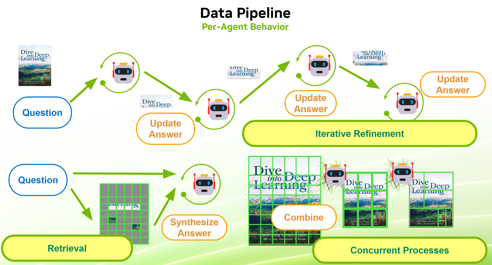
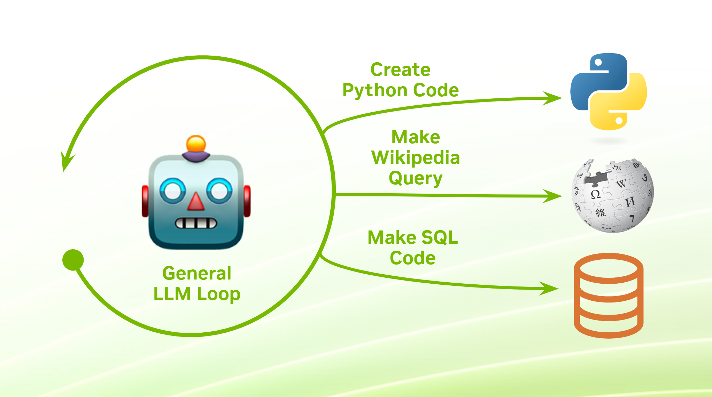

<center><a href="https://www.nvidia.com/en-us/training/"></a></center>

# <font color="#76b900"> **Notebook 7:** Towards Orchestration and Agentics</font>

Welcome back to the course environment! In the previous notebook, we ventured into the realm of LLM servers, deploying models capable of handling complex instructions and engaging in conversations. We learned how to interact with these models using various interfaces and touched upon the initial steps of LLM orchestration.

Now, we're going to dive deeper into orchestrating LLMs to build sophisticated applications. Think of LLM orchestration as conducting a symphony, where different components — prompts, retrieval mechanisms, routing strategies, and tools — all play harmoniously to produce powerful end-user applications.

#### **Learning Objectives:**

By the end of this notebook, you will:
- Understand how to approach non-trivial LLM tasks like long-form reasoning and generation.
- Learn retrieval techniques to enhance context and improve LLM outputs.
- Explore routing strategies to direct tasks to appropriate models or tools.
- Discover how to integrate external tools to extend the capabilities of LLMs.
- Develop agentic systems that can reason and act iteratively, culminating in the ReAct loop.


```python
import requests
from langchain_nvidia_ai_endpoints import ChatNVIDIA

## USE THIS ONE TO START OUT WITH. NOTE IT'S INTENTED USE AS A VISUAL LANGUAGE MODEL FIRST
# model_path="http://localhost:9000/v1"
## USE THIS ONE FOR GENERAL USE AS A SMALL-BUT-PURPOSE CHAT MODEL BEING RAN LOCALLY VIA NIM
model_path="http://nim:8000/v1"
# ## USE THIS ONE FOR ACCESS TO CATALOG OF RUNNING NIM MODELS IN `build.nvidia.com`
# model_path="http://llm_client:9000/v1"

model_name = requests.get(f"{model_path}/models").json().get("data", [{}])[0].get("id")
%env NVIDIA_BASE_URL=$model_path
%env NVIDIA_DEFAULT_MODE=open

if "llm_client" in model_path:
    model_name = "meta/llama-3.1-70b-instruct"

llm = ChatNVIDIA(model=model_name, base_url=model_path, max_tokens=5000, temperature=0)
```

<hr>
<br>

## **Part 7.1:** Structuring LLM Workflows

Prompt engineering is the art and science of crafting inputs that guide LLMs to produce desired outputs. Since the models are inherently **stochastic parrots** at heart - meaning they output probabilistic responses based on their input and training data - you can expect certain tasks to be far easier than others for even the most powerful models. Fortunately, we know exactly what most of these models are best at: **"summarization" or synthesis-style tasks**.

**The reasons for a specialty in short-form generation is actually quite simple:**
- Long-form text generation is harder to keep on track and LLMs are likely to derail due to accumulating error of autoregressive sampling.
- Most developers want to conserve generation length and would rather have accidentally-overshort responses over accidentally-overlong ones.
- In chat applications (which are usually the most popular default models, and the most popular instruction format to work with), shorter-form, concise, and "summary-like" responses are often preferred in real-world scenarios.

**With that being said, long context reasoning is valued greatly:**
- The ability to specify long outputs to help reinforce generation style/format is highly desirable from an end-user perspective.
- Even if the generative prior for responses is towards short outputs, the accumulation of said short outputs can become very long very quickly.

**For these reasons, most models tend to be trained for short-form generation and long-form context ingestion.** This makes LLMs perfect for tasks like summarization and long-form question-answering, which at its core boils down to the problem of **knowledge synthesis** or **distillation**. This idea was already explored in code in the previous notebook, but it's important to formalize and keep in mind going forward.


```python
from langchain_core.prompts import ChatPromptTemplate
from langchain_core.output_parsers import StrOutputParser
from langchain_core.runnables import RunnablePassthrough
from chatbot.jupyter_tools import FileLister

import os 
filenames = [v for v in sorted(os.listdir("temp_dir")) if v.endswith(".ipynb")]

chat_prompt = ChatPromptTemplate.from_messages([
    ("system", (
        "You are a helpful DLI Chatbot who can request and reason about notebooks."
        " Be as concise as necessary, but follow directions as best as you can."
        " Please help the user out by answering any of their questions and following their instructions."
    )),
    ("human", "Here is the notebook I want you to work with: {full_context}. Remembering this, start the conversation over."),
    ("ai", "Awesome! I will work with this as context and will restart the conversation."),
    ("placeholder", "{messages}")
])

def compute_context(state: dict):
    return FileLister().to_string(files=state.get("filenames"), workdir=".")

pipeline = (
    RunnablePassthrough.assign(full_context = compute_context)
    | chat_prompt 
    | llm 
    | StrOutputParser()
)

chat_state = {
    # "filenames": ["07_intro_agentics.ipynb"],
    # "messages": [("human", "Can you give me a summary of the notebook?")],
    ## Reason about the entire course at once. This will be much slower and does not scale to larger document pools. 
    "filenames": filenames, 
    "messages": [("human", 
        "Can you give me a summary of the course, making sure to mention every notebook?"
        " Do a paragraph per notebook, and finish by explaining big-picture ideas to help an"
        " instructor explain the material and understand which parts of the course to refer to when addressing questions."
    )],
}

short_summary = ""
for chunk in pipeline.stream(chat_state):
    print(chunk, end="")
    short_summary += chunk
```

<br>

### Breaking Free From Limitations

Despite the natural propensities of modern models, people are still able to do complex tasks like long-form generation and even longer-form context ingestion through a variety of scalable ways. **These techniques rely on the key assumption that an LLM can be called programmatically, repeatedly, independently, and concurrently (all of which a server-based deployment allows).**

<div></div>

#### **Iterative Generation** 

Much like the way that dialog is technically a long-form progressive generation task (in which half of the generation is done by a human), an arbitrarily long-form document can be generated one piece at a time. If an LLM is trained to only output 5000 tokens at a time - but can reason about 100,000 tokens at a time, then perhaps you could generate a full-length document one step at a time?
- **Full-Context:** In the case that iterative generation stays within the input context limits of the model, then the full-context approach of just keeping the conversational history, task history, document history, etc. may be sufficient. 
- **Running State:** In the case when long context accumulation is undesirable, a running summary or other type of accumulated history from previous generations may be sufficient. This is often called **"iterative refinement"** and has the advertised benefit of maintaining **global context** (or at least hindsight context, with global obtainable through pre-processing). 
- **Sliding Window:** When you want to refine a document and only care about **local context** (i.e. for boundary consistency), you may elect to discard the overall history and only consider a window of content at a time. This is especially relevant for **translation tasks** where you can translate a document slice while remembering both the previously-translated chunk and the subsequent yet-untranslated chunk. 


```python
message_prompt = (
    "Give me a structured summary of the course, making sure to note all sections and points?"
    " This is a one-notebook-at-a-time process, and the next notebook is the one provided in context."
    "\n\nThe following is a running summary of previous notebooks: \n\n{running_summary}\n\n"
    "Output only the summary of the currently-provided notebook, but explain the logical connections to the rest of the course."
    "Make sure the descriptions are also dense in key words that would be useful for searching through the notebooks via a bibliography."
    " Only output the following format, with no other structures, extra newlines, or info not grounded in context:\n<notebook>.ipynb"
    "\n - <Section 1 Name (As Seen In Notebook)>: Decent Description, including frameworks used, important topics, etc."
    "\n - ..."
    "\n - Main Ideas and Relevance To Course: Decent Description, dense with key features/frameworks/topics for bibliographic/semantic lookup."
    "\n - Important Code: Types of syntaxes, variables, etc that are more specific to this notebook, like classes, variables, topics, terms, etc."
    "\n - Connections to previous notebooks: Decent Description, dense with key features/frameworks/topics for bibliographic/semantic lookup."
    "\n - Relevant Images: Brief descriptions of images (i.e. , no non-image files) with local-scope URLs."
)

running_summaries = []
running_summary = "No summary yes. This is the first notebook."

for name in filenames:
    if not name.endswith(".ipynb"):
        continue
    buffer = ""
    chat_state = {
        "filenames": [name],
        # "messages": [("human", message_prompt.format(running_summary=running_summary))]                    ## Full history
        "messages": [("human", message_prompt.format(running_summary=(running_summaries or ["None"])[-1]))]  ## Sliding window
        # "messages": [("human", message_prompt.format(running_summary="Not provided"))]                     ## No history, 
    }
    for chunk in pipeline.stream(chat_state):
        buffer += chunk
        print(chunk, end="")
    print("\n" + "*" * 84)
    running_summaries += [buffer]
    running_summary = "\n\n".join(running_summaries)
```

<details>
<summary><b>Notes On Iterative Refinement:</b></summary>
<ul>
    <li>The example above shows several different strategies (full-context, sliding-window, and no history). You will see that the first two generate different main idea summaries but should be largely the same in this context (but full-context will start to fall about for longer-form refinement problems). No-history will also have some problems (partially because more info is needed and partially because the prompt instructions imply that every notebook is a first notebook).</li>
    <li>Note how dialogue and chain-of-thought (think step-by-step) reasoning are also inherently refinement problems where a response is refined from the full-context (e.g. chat history) which then serves as a new addition for the next refinement step.</li>
    <li>Remember that LLMs strongly benefit from having input that "could have practically been generated". A common cause for hallucination involves bombarding the LLM with context that it should not have been able to generate without adequately informing the LLM that it did not generate it.</li>
</ul>
</details>

<br>

#### **Parallel Generation**

In some contexts, iterative generation may be unnecessarily slow or may accumulate an intractable amount of context or error. In these cases, you may want to independently reason about a bunch of smaller pieces of your input and then join the results together at a later point. 
- **Canonicalization:** If you have a task with largely-independent components, you can reason about them independently and progress them into a standardized representation which can be easier to work with later. For example, making parts of a document shorter, extracting important details, or even expanding an short abstract description to a fuller form.
- **Structurization:** Given the task of extracting global context from a long-form document (AKA summarizing), you could make summaries of a window, then summarize those summaries, and so on and so forth until you have a singular summmary. Similar ideas of structurization including [**insertion into knowledge graphs with value-edge-value**](https://neo4j.com/developer-blog/knowledge-graph-llama-nvidia-langchain/), [**insertion of embeddings into vector stores for semantic retrieval**](https://arxiv.org/abs/2312.10997), [**and insertion into SQL databases**](https://developer.nvidia.com/blog/new-llm-snowflake-arctic-model-for-sql-and-code-generation/) can happen in a large-scale application of LLMs on large repositories of data.
- **Ensembling:** Given an objective to do something with an LLM, an ensemble of different approaches can be used to independently try to solve a natural-language issue. The result of all of these apporaches can be combined to form the final reasoning.


```python
from langchain_core.runnables import RunnableLambda
from functools import partial

message_prompt = (
    " Give me a rigorous summary of only bullet #{section_i} of the outline. Do not summarize any other sections."
    " Output should be a few compact-but-dense paragraphs long and only summarize a fraction of the notebook (bullet {section_i})"
    " such that a reasonable person would be able to understand everything from that section"
    " (while knowing roughly how it ties in with the whole notebook) from the summary." 
)

notebook_chunks = []

def summarize_section(state):
    name, i = state.get("name"), state.get("i")
    print(f"(+{name[1]}.{i})", end="")
    output = pipeline.invoke({
        "filenames": [name],
        "messages": [
            ("human", "Please give me a structured outline of the notebook"), 
            ("ai", state.get("outline")),
            ("human", message_prompt.format(section_i=i))],
    })
    print(f"(-{name[1]}.{i})", end="", flush=True)
    return output

task_keys = []
task_args = []
task_vals = []
num_tasks = 6

for name, outline in zip(filenames, running_summaries):
    task_keys += (nb_keys := [f"Notebook {name} Part {i}" for i in range(1, num_tasks+1)])
    task_args += (nb_args := [{"name": name, "i": i, "outline": outline} for i in range(1, num_tasks+1)])
    ## Notebook-level parallelization: Bottlenecks down to one notebook at a time
    # task_vals += RunnableLambda(summarize_section).batch(nb_args)

## All-at-once parallelization: Bottleneck is the set maximum concurrency (since threads are hardware-limited)
task_vals = RunnableLambda(summarize_section).batch(task_args)
```

<details>
<summary><b>Notes On Parallelization:</b></summary>

- If you want to parallelize across inputs to a pipeline, `batch` is a great option that already incorporates thread-safety and concurrency limits (you can guess at maximum concurrency by seeing when the first thread finish occurs). If you wanted to parallelize across different chains (i.e. you want the same data to go through multiple pipes concurrently), you could use `RunnableParallel`. Both are far easier (but also less customizable) than semaphored or thread-pooled approachs which allow much more custom approaches.

- We tweaked our prompt and numbers to try to get a summary for each section, but note how the "summarize part i" objective is ill-defined when the notebook doesn't have enough parts. This is sufficient for our purposes in the assessment, but is definitely not ideal in the grand scheme of things. You will learn strategies later which will mitigate this "language-in -> language-out" problem (***HINT***: see **structured output**).

</details>

**Saving The Results**

To help visualize these results, feel free to run the following cell to save them to a JSON file. These exports are used to construct the example chatbot, so it's interesting to see what came out of this pipeline. 


```python
## Note, we're going to need these generations for the assessment, so save them here
nbsummary = {
    "course": "NVIDIA Deep Learning Institute's Instructor-Led Course called \"Rapid Application Development with Large Language Models\"",
    "summary": short_summary, 
    "filenames": filenames
}

for i, (name, outline) in enumerate(zip(filenames, running_summaries)):
    if not name.endswith(".ipynb"): continue
    nbsummary[name] = {"outline": outline}
    task_iter = range(i*num_tasks, (i+1)*num_tasks)
    nbsummary[name]["sections"] = [task_vals[j] for j in task_iter]
        
import json
json.dump(nbsummary, open('notebook_chunks.json', "w"), sort_keys=True, indent=4)

# with open('notebook_chunks.json', 'r') as fp:
#     nbsummary = json.load(fp)
```

#### **Progressing Beyond Model Priors**

These formulations allow the large-language model to not only reason with but also create arbitrarily long and arbitrarily short responses. When implemented programmatically, they also give you control over context scope and bottlenecks, allowing for a trade-off between lightweight limited-scope operations and well-informed slow processes. 

However, these techniques alone are just engineerings on top of a language model, and are self-contained to the capabilities and knowledge base of its immediate context, its prompts, and its priors. **The biggest potential of LLMs lies not in what's static inside the model weights and a pre-computed workflow, but rather its incorporation with a rich environment to guide its progression and accept its responses as actions.**

<hr>
<br>

## **Part 7.2:** Intro to Tooling

**Tooling** takes these techniques a step further by integrating external data sources, computational tools, and dynamic systems into the generation process. The key idea is that an LLM can be enhanced by leveraging additional resources outside of its own internal parameters to further adapt, retrieve, learn, and impact the environment on an orchestration level. 

### **Fundamentals of Tooling:**

For an LLM to interact with an external environment, **one** of the following must happen:
- **Observing System:** Its context can be enriched with some programmatic query which changes based on application state. 
    - **[Optionally]** It will be able to change the application state after recieving its state-dependent context. 
- **Interacting System:** It must can a query to an environment that will honor its request and change the application state. 
    - **[Optionally]** It will recieve feedback from the environment after it makes a request.

**An observing system is trivial to conceptualize,** since the only requirement is some semantically-understandable context. Fill in a prompt with some variables like the filenames inside a directory and you now have an LLM component that can tell you about your files. Allow a user to pick which document is fed into the LLM, and it's reasoning with a user's choice. The difficulty here is not "how to construct the context programmatically," but "what to put in it," and this difficulty is merely the difficulty of selection. 

**In contrast, an interacting system property is a bit harder to enforce,** since our LLM outputs are naturally unstructured. In the previous section, our LLMs were interacting with other LLMs since both are text-in text-out, but mapping to a regular non-LLM utility might be a bit more challenging, right?


#### **Grammar Enforcement**

Luckily for us, LLM sampling utilities and orchestration tools have worked hard to bridge this divide and allow us to call tools directly using an innovation called **grammar enforcement**!

Recalling all of our pipeline discussions from the earlier sections, algorithm input schemas are naturally defined as key-value-pair dictionaries:

```python
{
    "arg1": value1,
    "arg2": value2,
    ...
}
```

From an LLM perspective, assuming that the variable names and values are human-interpretable, the meaning can naturally be inferred and you could feed this in as context with no issues. Generating such a schema, however, is a bit less easy. Developers figured out early on that while you can "ask" an LLM for "valid python code" or "valid JSON with only the correct keys", such tactics usually required post-processing and failures would occur with some regularity. 

Nowadays, many models support **"schema"** inputs which specify a required format for the output. Consider the following tool instantiation, which creates an object that naturally works with this interface:


```python
from langchain.tools import tool

@tool
def add(
    explanation_of_what_the_user_wants: str, ## Optional. Gives some food for thought.
    a: float, 
    b: float
) -> int:
    """Adds a and b. Requires both arguments. Can be repurposed for subtraction"""
    return a + b

print(add.name)
print(add.description)
print(add.args)
```

When the input schema is fed into the LLM service, the generation will have to conform to the required grammar on a sampling level. In other words, regardless of the overall probability vector generated from each autoregressive call: 
- The first several tokens will have to be `{'a': `, in that order.
- The token range will be limited to some subset of the valid tokens of `0123456789.e-+}` until `}` is generated.
- The next tokens samples will have to be `}, {'b': `.
- Repeat until done, with the last `}` being a manditory stop token.

Given that our `tool` component automatically aggregates details like the input schema as part of its construction, we can simply bind the input schema to our connector using `with_structured_output` and then assume its invocation will have to conform.

Below we show an example with some important notes to consider:

- The LLM itself is not aware of this grammar enforcement and may derail if left on its own. As such, it is good practice to AT LEAST provide the argument schema - if not a more general format-following instruction like the default LangChain instruction format string - to the LLM.

- In addition to grammar enforcement, Llama and other similar models are [**explicitly trained with function-calling support in mind**](https://github.com/meta-llama/llama-models/blob/6ad6fd6bb8f5fc841acecc2e48958eee25ff3b1c/models/llama3_1/prompt_format.md?plain=1#L306). You will notice in the later sections that the grammar enforcement is probably paired with a parser for `<function=foo>{}</function>`-like outputs.


```python
from langchain_core.runnables import RunnablePassthrough
from langchain_core.output_parsers import PydanticOutputParser, StrOutputParser
from random import random

add_tool = (
    llm.with_structured_output(add.input_schema).bind(temperature=0)
    | dict
    | {
        "args": RunnablePassthrough(),
        "result": add,
    }
)

for i in range(10):

    a, b = random() * 10e10, random() * 10e10 
    # a, b = round(a), round(b)
    
    tool_output = add_tool.invoke([
        ("system", PydanticOutputParser(pydantic_object=add.input_schema).get_format_instructions()),
        # ("system", f"Assume schema of {add.args}"),  ## Lighter reinforcement.
        ("user", f"Add the values of {a} and {b}."),
    ])

    tool_a = tool_output.get("args").get("a")
    tool_b = tool_output.get("args").get("b")
    tool_result = tool_output.get("result")
    
    print("[PASSED]" if (a+b) == tool_result else "[FAILED]", end=" ")
    print(f"{tool_a} + {tool_b} = {tool_result} vs {a + b}" )
    
    if "explanation_of_what_the_user_wants" in tool_output.get("args"):
        print("\tThoughts:", tool_output.get("args").get("explanation_of_what_the_user_wants"))
```

**Things To Try Out:**
- What happens if you don't provide a system message? Does it still work?
- What happens if you move the system messages back into the user messages? Does it work as well?
- What happens if you don't include the `explanation_of_what_the_user_wants` variable? Does it perform better or worse?

On the microscopic level, you've made an LLM do addition! This is... honestly not that big of a deal, right? Well, even on that narrow scale, it's probably better than asking the LLM to do it for you...


```python
for i in range(10):

    a, b = random() * 10e10, random() * 10e10 
    a, b = round(a), round(b)
    
    tool_output = (llm | StrOutputParser()).invoke([
        ("user", f"Add the values of {a} and {b}. Only return the final answer, not the arithmetic"),
    ])
    
    print("[PASSED]" if str(a+b) in tool_output else "[FAILED]", end=" ")
    print(f"{a} + {b} = {tool_output} vs {a + b}" )
```

<br>

On a macroscopic level though, we can extend structured output generation to allow our LLMs to adhere to almost any predefined output schema. This capability is crucial as we move toward treating LLMs as core components of a larger software pipeline.

<hr>
<br>

## **Part 7.3:** Multi-Tool Agentic Systems

We said earlier that interacting with an environment requires a system that can either observe and reason about a dynamic environment or impact and react to it directly. It turns out that a system that can do both is known to be **agentic**. 

> More generally, a system is ***agentic*** if it can observe, think about, react to, and act upon an environment with a personal directive. 
>
> Put another way, a system is ***agentic*** if it can pick a tool or action based on its current state, use it to impact something, and understand how its decision progresses it towards a goal.

**At a bare minimum, an agent generally needs only one component:** 
- A routing mechanism to pick a pathway.

**Further than that, many agents also incorporate:**
- A prediction of the arguments for the chosen pathway, if necessary.
- A buffer to accumulate memory, if necessary.
- An overarching or selectively-applied directive, if necessary.

<div></div>

<br>

By that definition, the following example is technically a basic agentic loop that minimally-satisfies as an agent:


```python
from langchain_core.output_parsers import StrOutputParser
from langchain_core.prompts import ChatPromptTemplate
from langchain_core.runnables import RunnableBranch
from random import random

sys_msg = (
    "Please help the user. After every response, output '[stop]` if the conversation should end and [pass] otherwise."
)

prompt = ChatPromptTemplate.from_messages([("system", sys_msg), ("placeholder", "{messages}")])
chain = prompt | llm | StrOutputParser()

state = {"messages": []}
agent_msg = ""

while True:
    try: 
        if "[stop]" in agent_msg: break
        else: pass
        
        ## TODO: Update the messages appropriately
        human_msg = input("\n[Human]:")
        state["messages"] += [("human", human_msg)]

        ## Initiate an agent buffer to accumulate agent response
        agent_msg = ""
        print("\n[Agent]: ", end="")
        ## TODO: Stream the LLM's response directly to output and accumulate it
        for token in chain.stream(state):
            agent_msg += token
            print(token, end="")

        ## TODO: Update the messages list appropriately
        state["messages"] += [("ai", agent_msg)]
    except KeyboardInterrupt:
        print("KeyboardInterrupt")
        break
```

<br>

Under our agentic abstraction, the loop above uses a simple *"does the output contain `[stop]`"* heuristic to decide whether to continue the conversation or not. Is this trivial? Yes, and it's technically just a routing mechanism `"[stop]" in agent_msg` and a subsequent tool call (`break`), but its logical extension is surprisingly powerful! 

- **[Multi-Tool]** What if we had more tools than just `pass` and `break`?
- **[State Management]** What if our tool choice (and the tool's argument choice) changes the behavior of our system?
- **[Retrieval]** What if our tool enriched out context with relevant information?
- **[Agentic Multimodality]** What if our tools allowed the agent to output other modalities (images, audio, video, etc) but only when necessary?

### **A Simple Multi-Tool Agent**

Of the classes above, **multi-tool agentics** is the most encompassing since almost all of the examples *could* fall under it. To explore this concept, let's create a calculator agent with the following tools:


```python
from langchain_core.tools import tool

@tool
def add(a: float, b: float) -> int:
    """Adds a and b. Requires both arguments."""
    return a + b

@tool
def subtract(a: float, b: float) -> int:
    """Subtracts a and b. Requires both arguments."""
    return a + b

@tool
def multiply(a: float, b: float) -> int:
    """Multiplies a and b. Requires both arguments."""
    return a * b

@tool
def divide(a: float, b: float) -> int:
    """Divides a by b. Requires both arguments."""
    return a / b

@tool
def power(a: float, b: float) -> int:
    """Raises a to the power of b. Requires both arguments."""
    return a ** b

@tool
def no_tool() -> str:
    """Null tool; says no tool should be used"""
    return "No Tool Selected"
```

If we wanted to, we **could** create a routing mechanism to first predict which tool to use and then call the tool. However, this process is so common and useful that many systems support it on the server-side in much the same way as structured output:


```python
from langchain_core.runnables import Runnable, RunnableAssign, RunnablePassthrough, RunnableLambda
from langgraph.prebuilt import ToolNode


math_prompt = ChatPromptTemplate.from_messages([
    ("system", "You're a math bot! Help the user as much as possible."),
    ("placeholder", "{messages}"),
])

toolset = [
    add,
    multiply,
    divide,
    power,
    no_tool,
]

## Create a client-side resolved which executes the tool picked by the server.
tool_node = ToolNode(toolset)

simple_chain = (
    math_prompt 
    ## Bind the tools to the connector, effectively feeding in the possible schemas on every invocation.
    | llm.bind_tools(toolset)
    # | {"messages": lambda x: [x]} | tool_node | RunnableLambda(lambda x: x.get("messages"))
)
simple_chain.invoke({"messages": [("user", "What's 56766*30432?")]})
```


```python
question = "What's 333333*555555?"
print(f"\nSimple {question = }")
print(simple_chain.invoke({"messages": [("user", question)]}))

question = "What's 333333*555555 and 444444+222222?"
print(f"\nDouble {question = }")
print(simple_chain.invoke({"messages": [("user", question)]}))

question = "What's 555555 times (444444 plus 222222)?"
print(f"\nComplex {question = }")
print(simple_chain.invoke({"messages": [("user", question)]}))

question = "Introduce yourself in 10 words or less!"
print(f"\nRandom {question = }")
print(simple_chain.invoke({"messages": [("user", question)]}))
```


```python
# llm._client.last_inputs
```

**As you can see from this demo:**
- This internal router in this server deployment is only capable of thinking one tool call at a time.
- This internal router doesn't actually inform the model of its schemas. It only enforces them at generation time.
- You may occasionally see content get generated instead of the `no_tool` call. This means that in addition to our client-side no_tool support, there is also a server-side version which changes the behavior of the endpoint towards unstructured generation.

### **[Advanced]** Conversational Tool-Calling

Using some more advanced LLM orchestration paradigms, we can improve on our default tool-calling implementation by making a service that can do **both conversation and tool-calling in what seems like a single generation**. This is a more weedy topic and we will not go into much detail, but there several important reasons to bring this up:
- The intuitions associated with server-siding agentic capabilities underpins much of the more advanced custom abilities like tool-aware endpoints, server-side reflection/chain-of-thought, and endpoint-specific knowledge bases. 
- For the assessment, we would like to leverage a more streamlined agentic framework called LangGraph which is significantly easier to do with conversational tool-calling. By constructing and motivating this module, we will be able to have code parity with models like OpenAI's GPT4.

The following cell block introduces a custom `ConversationalToolCaller` component which is meant to illustrate how one might go about transitioning a bespoke tool-calling formulation into a streamlined endpoint:


```python
from chatbot.conv_tool_caller import ConversationalToolCaller

agent_prompt = ChatPromptTemplate.from_messages([
    ("system", (
        "You're a math bot! Help the user as much as possible by using the tools to answer their questions."
        " Think step-by-step, and work out your math using the tools provided."
    )),
    ("placeholder", "{messages}"),
])

tool_instruction = (
    "You have access to the tools listed in the toolbank. Use tools only within the \n<function></function> tags."
    " Select tools to handle uncertain, imprecise, or complex computations that an LLM would find it hard to answer."
    " You can only call one tool at a time, and the tool cannot accept complex multi-step inputs."
    "\n\n<toolbank>{toolbank}</toolbank>\n"
    "Examples (WITH HYPOTHETICAL TOOLS):"
    "\nSure, let me call the tool in question.\n<function=\"foo\">[\"input\": \"hello world\"]</function>"
    "\nSure, first, I need to calculate the expression of 5 + 10\n<function=\"calculator\">[\"expression\": \"5 + 10\"]</function>"
    "\nSure! Let me look up the weather in Tokyo\n<function=\"weather\">[\"location\"=\"Tokyo\"])</function>"
)

tool_prompt = (
    "You are an expert at selecting tools to answer questions. Consider the context of the problem,"
    " what has already been solved, and what the immediate next step to solve the problem should be."
    " Do not predict any arguments which are not present in the context; if there's any ambiguity, use no_tool."
    "\n\n<toolbank>{toolbank}</toolbank>\n"
    "\n\nSchema Instructions: The output should be formatted as a JSON instance that conforms to the JSON schema."
    "\n\nExamples (WITH HYPOTHETICAL TOOLS):"
    "\n<function=\"search\">[\"query\": \"current events in Japan\"]</function>"
    "\n<function=\"translation\">[\"text\": \"Hello, how are you?\", \"language\": \"French\"]</function>"
    "\n<function=\"calculator\">[\"expression\": \"5 + 10\"]</function>"
)

conv_llm = ConversationalToolCaller(
    tool_instruction=tool_instruction, 
    tool_prompt=tool_prompt, 
    llm=llm
).get_tooled_chain()

agent_chain = agent_prompt | conv_llm.bind_tools(toolset)

response1 = agent_chain.invoke({"messages": [("user", "What's (56766*30432+3043)/99?")]})
print(repr(response1))
```

If streamed, the code above will first generate one token at a time associated with the message, and will then dump the function call arguments for a tool call while maintaining grammar constraints. When not streamed, the response comes all at once as expected. 

Following this invocation, a common approach is to use a ToolNode component to strip the message of tool calls and pair each of them with an appropriate executor to produce the right output. This can be done as follows:


```python
from langgraph.prebuilt import ToolNode

tool_caller = RunnableLambda(lambda string: ToolNode(toolset).invoke({"messages": [string]})["messages"])

tool_caller.invoke(response1)
```

The code for this is available at [`conv_tool_caller.py`](conv_tool_caller.py) and introduces several layers of complexity which are out of scope for the course. However, we still recommend checking it out as there are several nice nuggets of information regarding the delivery of a stream over a port interface and the acceptance of customization arguments from a client access. 

<hr>
<br>

## **[Exercise] Part 7.4:** Enabling The Agentic Loop

Now that we have a conversational tool-calling endpoint, we should now be all set up to create **something** resembling an agentic loop. 
- In the previous notebook, we set up the **simple chat loop** that allowed us to accumulate a chat history.
- In this notebook, we will be setting up an **multi-step agentic loop** which will allow our system to call multiple tools before getting back to the user with a final answer.

<div></div>

We will elect to implement the [**ReAct (Reason+Act)** loop](https://arxiv.org/abs/2210.03629) which makes a simple assumption: 

**Keep calling for and observing the results of tool calls in an interleaving manner until you have a final answer.**

Sometimes this is as explicit as actually making "Final Answer" and "Ask The User" tools, and other times it can be implied by merely skipping the user when no tool is called. We will pick the later, since our endpoint now supports conversation and tool-calling, all within a single request. 


```python
from langchain_core.messages import ToolMessage

state = {"messages": []}
agent_results = []

## BEGIN EXERCISE

while True:
    try: 
        ## TODO: If a tool is not called, the answer-generating loop ends. 
        ##   When this happens, ASK THE USER FOR A NEW INPUT.
        if not agent_results:
            state["messages"] += [("human", input("\n[Human]:"))]

        print("\n[Agent]: ", end="")
        agent_response = None
        for chunk in agent_chain.stream(state):
            agent_response = chunk if not agent_response else agent_response + chunk
            print(chunk.content, end="")
        print()

        ## Get the agent message (pre-tool call), the function arguments, and the call invocation 
        agent_fncalls = [call.get("function") for call in agent_response.additional_kwargs.get("tool_calls", [])]
        agent_results = [result.content for result in tool_caller.invoke(agent_response)]
        if agent_fncalls: print(agent_fncalls)
        if agent_results: print(agent_results)

        ## TODO: If a tool is called, record it in the conversational history.
        if not agent_results:
            response = agent_response.content
        else: 
            response = (
                f"{agent_response.content}\n"
                f"\n<RESULT>{agent_results}</RESULT>"
            )
        
        state["messages"] += [("ai", response)]
        
    except KeyboardInterrupt:
        print("KeyboardInterrupt")
        break
```

**Potential Question:** 
- What's (56766*30432+3043)/99?

**Answer Progression:**
- Step 1: 1727502912
- Step 2: 1727505955
- Step 3: 17449555.101010103

**Challenge Question:**
- Compute the fibonacci sequence up to 25.
- Now use tools to compute the digits 26 - 30.
- How much bigger is the 30th number vs the 25th?

<hr>
<br>

# <font color="#76b900">**Wrapping Up**</font>

In this section, we introduced stateful LLM systems and the logic that underpins more complex and controllable (or even attempted self-controlling) formulations! This is really only the beginning of the exciting things you can do with LLMs, but hopefully you've enjoyed this introduction! 

Going from the limited formulations of task-specific encoders to the set of powerful generative and self-guiding models, we hope you can appreciate that every model we've discussed serves some place in the stack! Whether it's a key backbone component, a cheap complementary mechanism, a source of inspiration for further development, or a stepping stone to advancements in the field, try to keep these tools in your arsenal going forward and use the ones that work best for your settings!

**In the next and final notebook, we'll be asking you to make a more specialized pipeline to get some practice with and expand upon the previous techniques!**


```python
# ## Please Run When You're Done!
# import IPython
# app = IPython.Application.instance()
# app.kernel.do_shutdown(True)
```

<center><a href="https://www.nvidia.com/en-us/training/"></a></center>
