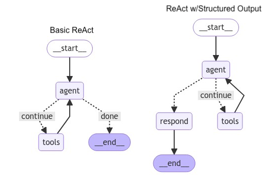

<center><a href="https://www.nvidia.com/en-us/training/"></a></center>

# <font color="#76b900"> **Notebook 7.5:** LangGraph

**Congratulations On (Almost) Finishing The Course!** 

We hope you've enjoyed the journey and have gained valuable skills to create advanced language model applications. 
- **In Notebook 8**, you'll be able to put those skills to the test to make an integrated system that straddles several domains.
- **In this notebook,** we're going to briefly introduce you to LangGraph, which is a popular multi-agent orchestration framework which makes some useful design decisions and is a fantastic starting point for those looking to go further into this area!

### **Setup**

Before we begin, let's set up our environment by importing the necessary libraries and initializing our language model.


```python
import requests
from langchain_nvidia_ai_endpoints import ChatNVIDIA
from langchain_openai import ChatOpenAI

## USE THIS ONE TO START OUT WITH. NOTE IT'S INTENTED USE AS A VISUAL LANGUAGE MODEL FIRST
# model_path="http://localhost:9000/v1"
## USE THIS ONE FOR GENERAL USE AS A SMALL-BUT-PURPOSE CHAT MODEL BEING RAN LOCALLY VIA NIM
model_path="http://nim:8000/v1"
# ## USE THIS ONE FOR ACCESS TO CATALOG OF RUNNING NIM MODELS IN `build.nvidia.com`
# model_path="http://llm_client:9000/v1"

model_name = requests.get(f"{model_path}/models").json().get("data", [{}])[0].get("id")
%env NVIDIA_BASE_URL=$model_path
%env NVIDIA_DEFAULT_MODE=open

if "llm_client" in model_path:
    model_name = "meta/llama-3.1-70b-instruct"

llm = ChatNVIDIA(model=model_name, base_url=model_path, max_tokens=5000, temperature=0, streaming=True)
```

----

And lastly, let's load in our notebook names and also the previously-computed notebook summaries dictionary. We'll default to just using the summaries throughout this notebook, but feel free to experiment. 


```python
import json
import os

with open('notebook_chunks.json', 'r') as fp:
    nbsummary = json.load(fp)

filenames = nbsummary.get("filenames")
outlines = "\n\n".join([v.get("outline") for k,v in nbsummary.items() if isinstance(v, dict)])
# outlines
```

<hr>
<br>

## **Part 8.1:** Agentic Notebook Retrieval

For the first part of the assessment - which is meant to demonstrate a new abstraction for agentic workflows - we'll create an agent capable of retrieving information from notebooks and interacting with the user in a meaningful way.

**Specifically, our agent will:**
- Interact with the user to understand their queries.
- Access and retrieve information from a set of Jupyter notebooks.
- Provide concise and helpful responses based on the retrieved information.

To pull in a decent starting point, lets recreate our conversational agent from the last notebook and keep our prompts here for ease of customization:


```python
from chatbot.conv_tool_caller import ConversationalToolCaller
from langchain_core.prompts import ChatPromptTemplate
from langchain_core.output_parsers import StrOutputParser
from langchain.pydantic_v1 import Field


tool_instruction: str = (
    "In addition to your directive, you have access to the tools listed in the toolbank."
    " Use tools only within the \n<function></function> tags."
    " Select tools to handle uncertain, imprecise, or complex computations that an LLM would find it hard to answer."
    " You can only call one tool at a time, and the tool cannot accept complex multi-step inputs."
    "\n\n<toolbank>{toolbank}</toolbank>\n"
    "Examples (WITH HYPOTHETICAL TOOLS):"
    "\nSure, let me call the tool in question.\n<function=\"foo\">[\"input\": \"hello world\"]</function>"
    "\nSure, first, I need to calculate the expression of 5 + 10\n<function=\"calculator\">[\"expression\": \"5 + 10\"]</function>"
    "\nSure! Let me look up the weather in Tokyo\n<function=\"weather\">[\"location\"=\"Tokyo\"])</function>"
)

tool_prompt: str = (
    "You are an expert at selecting tools to answer questions. Consider the context of the problem,"
    " what has already been solved, and what the immediate next step to solve the problem should be."
    " Do not predict any arguments which are not present in the context; if there's any ambiguity, use no_tool."
    "\n\n<toolbank>{toolbank}</toolbank>\n"
    "\n\nSchema Instructions: The output should be formatted as a JSON instance that conforms to the JSON schema."
    "\n\nExamples (WITH HYPOTHETICAL TOOLS):"
    "\n<function=\"search\">[\"query\": \"current events in Japan\"]</function>"
    "\n<function=\"translation\">[\"text\": \"Hello, how are you?\", \"language\": \"French\"]</function>"
    "\n<function=\"calculator\">[\"expression\": \"5 + 10\"]</function>"
)

conv_llm = ConversationalToolCaller(
    tool_instruction=tool_instruction, 
    tool_prompt=tool_prompt, 
    llm=llm
).get_tooled_chain()
```

Feel free to make modifications to these prompts as you go along, as there will be various tweaks you can make to improve your agent's performance.

<br>

### **Part 7.5.1:** Introducing LangGraph

The **[LangGraph framework](https://github.com/langchain-ai/langgraph)** is a new addition that allows us to manage the conversation flow using a state graph. By leveraging LangGraph, we can define the agent's states, transitions, and actions in a structured manner, eliminating the need for a fully-custom event loop. This framework enhances scalability and maintainability, especially when dealing with multi-agent systems or intricate workflows.

#### How LangGraph Enhances Our Workflow:
- **State Management:** LangGraph allows for clear delineation of different states within the conversation, making it easier to track and manage the agent's progress and decisions.
- **Conditional Transitions:** With LangGraph, we can define conditional edges that dictate how the conversation flows based on certain triggers or conditions.
- **Modularity:** The framework promotes modularity by allowing different nodes (functions) to handle specific tasks, facilitating easier updates and expansions.

#### Why Is LangGraph Better Than Custom?
- **Designed For Multi-Agent Systems:** Unlike our while-loop which we could massage into a workable multi-state system, LangGraph takes a state graph approach to modeling the agentic traversal process. As such, it incorporates design patterns which scale naturally to non-sequential and even dynamic routines.
- **Streamlined Integrations :** As a relatively popular framework, LangGraph has accumulated a plethora of free and premium integrations which can greatly improve the development and deployment experience. The development team has released integrations like LangServe, LangSmith, and LangGraph-Studio, and the community at large has contributed a variety of reference applications which showcase both domain-specific applications and modular plug-and-play components. If you want a reference example of a relatively-novel agentic paradigm, there's a decent chance somebody's making a reference implementation in LangGraph. 

#### When Is LangGraph Worse Than Custom?
- **Potential Overkill:** In order to account for various multi-agent-specific feature sets and edge cases, LangGraph implements some strong assumptions which greatly increase its learning curve. If you can implement your solutions in basic LangChain, the runnable paradigm is more than sufficient to streamline your pipeline and bypasses several layers of complexity introduced by LangGraph. If, on the other hand, you know you want to scale your application and can benefit from its well-thought-out features/examples, then perhaps it's worth diving in and getting comfortable.
- **Pidgeonholed Abstraction:** While LangGraph is amazing, there is still room beyond LangGraph for deeper optimizations and stronger modularization. Those looking to make highly-specialized microservices may be interested in custom multithreading/multiprocessing schemes, advanced graph algorithms, and advanced resource management strategies which LangGraph may not offer  For those interested, consider checking out [**Knowledge-Graph-RAG**](https://github.com/NVIDIA/GenerativeAIExamples/tree/main/community/knowledge_graph_rag) as a reasonable gateway into such topics.

----

For the rest of the notebook, we'll use LangGraph to manage the flow between an agent and its toolset in order to recreate our manual loop from before. While our application may not be complex enough to require it, getting practice with LangGraph is good to help kickstart your familiarity with the larger multi-agent ecosystem. 

Below, let's define a typical graph that connects a human input node with an agent response node:


```python
from langgraph.checkpoint.memory import MemorySaver
from langgraph.graph import END, StateGraph, START
from langgraph.prebuilt import tools_condition
from langgraph.graph.message import AnyMessage, add_messages
from langchain_core.runnables import RunnableConfig
from typing import Annotated
from typing_extensions import TypedDict
import operator
import uuid
import datetime
from IPython.display import Image, display

##################################################################

class State(TypedDict):
    ## Dictates what kind of buffer the agent nodes can write to to pass information
    ## This one says "nodes can write to messages buffer, writing is equivalent to adding a message"
    ## NOTE: To override a message, you can add a message with the target message's ID. 
    ## NOTE: To delete a message, you can add a RemoveMessage with the target's message ID. 
    messages: Annotated[list[AnyMessage], add_messages]
    directives: Annotated[list[AnyMessage], add_messages]

def create_graph(nodes, edges, conditional_edges=[], state=State, thread_id="42", plot=True):
    graph = StateGraph(state)
    [graph.add_node(*node) for node in nodes]
    [graph.add_edge(*edge) for edge in edges]
    [graph.add_conditional_edges(*cedge) for cedge in conditional_edges]
    
    ## The checkpointer lets the graph persist its state
    ## Thread used to select buffer / memory compartment / etc to operate on 
    config = {"configurable": {"thread_id": thread_id}}
    memory = MemorySaver()
    app = graph.compile(checkpointer=memory)

    if plot: display(Image(app.get_graph(xray=True).draw_mermaid_png()))
    return app, memory, config

#################################################################

chat_prompt = ChatPromptTemplate.from_messages([
    ("system", (
        "You are a helpful DLI (Deep Learning Institute) Chatbot who can request and reason about notebooks."
        " Be as concise as necessary, but follow directions as best as you can."
        " Please help the user out by answering any of their questions and following their instructions."
    )),
    ("human", f"Here is the info I want you to work with for all future correspondences: {outlines}"),
    ("ai", "Awesome! I will proceed from scratch with this understanding."),
    ("placeholder", "{messages}")
])


def human_fn(state):
    ## Simple function to get user input and publish it to LangGraph message buffer
    return {"messages": ("human", input("[Human]"))} ## Adds to the message buffer associated with current thread


async def assistant_fn(state, config: RunnableConfig, **kwargs):
    ## Agent response function, which prompts the LLM with the message buffer and writes the results
    chain = chat_prompt | llm | StrOutputParser()
    response = await chain.ainvoke(state, config)    ## Config has callbacks which intercept stream generation
    return {"messages": [("ai", response)]}          ## Adds to the message buffer associated with current thread


app, memory, config = create_graph(
    ## These are the functions we want to include in our graph.
    nodes = [
        ("assistant", assistant_fn), 
        ("human", human_fn)
    ],
    ## These are the edges that connect our nodes to define agentic flow.
    edges = [
        (START, "human"),
        ("human", "assistant"),
        ("assistant", END),
    ]
)
```

To stream from this compiled graph, you can *roughly* use it like a runnable with some extra configurations and options:


```python
## Invoking from compiled LG app
output = await app.ainvoke({"messages": []}, config=config)
print(output.get("messages")[-1].content)

## Streaming from compiled LG app
async for msg, meta in app.astream({"messages": []}, stream_mode="messages", config=config):
    print(msg.content, end="")
```

**In your exploration, note the following features:**
- The compiled graph maintains conversational history! This is because we have a **checkpointer** (specified on graph compilation) working behind the scenes to keep track of dialog on thread "42" (dictated by our config). Note that the checkpointer is also more generally useful for integrations involving backtracking, archiving, human-in-the-loop, etc.
- You'll notice there is some decent buffer information in the metadata which could be good for output processing, filtering, archiving, etc.

<hr>
<br>

### **Part 7.5.2:** Recreating Our ReAct Loop

In the previous notebook, we implemented the basic ReAct loop using a custom buffer protocol in the form of a state dictionary, a while loop, and a break condition that triggers when a response doesn't invoke a tool. In LangGraph, this is a common paradigm often visualized with the following graph:

> <div></div>
>
> **Source: [ReAct Agent with Structured Output | LangGraph How-To Guides](https://langchain-ai.github.io/langgraph/how-tos/react-agent-structured-output/)**

Digging through resources like this, you will find multiple flavors of implementation which synergize the node logic, edge logic, and postprocessing logic to construct a cohesive streaming system. 

To complement these paradigms, we can take our previous idea and re-apply it here with a few key modifications:
- To stay consistent with our old while loop approach, an integrated `react` example is provided.
- As the while-loop approach compromises on flexibility by merging nodes that could have reasonable in-betweens, a more modular `agent + tools` option is provided and recommended. 
- To avoid having to re-specify the streaming procedure, a lightweight streaming function is defined.

After this cell, you will not have to reimplement these components again; instead, just pull them in and parameterize them to suit your needs. 


```python
from langchain.tools import tool
from typing import Literal
from langgraph.prebuilt import ToolNode
from langchain_core.messages import ToolMessage
from functools import partial

################################################################################################
# ## Combined agent + tools. Less flexible
# async def react_fn(state, config: RunnableConfig, llm = conv_llm, tool_node = None, **kwargs):
#     chain = chat_prompt | llm.bind(config=config)
#     out_msgs = []
#     while True:
#         new_state = {**state, "messages": state.get("messages") + out_msgs}
#         response = await chain.ainvoke(new_state)
#         out_msgs += [response]
#         if response.tool_calls:
#             out_msgs += [
#                 f"\n<RESULT>\n{result}\n</RESULT>" 
#                 for result in tool_node.invoke({"messages": [response]})["messages"]
#             ]
#         else: 
#             break
#     return {"messages": out_msgs}
################################################################################################

async def set_directive_fn(state, config: RunnableConfig):
    return {"directives": [state.get("messages")[-1]]}
    

async def agent_fn(
    state, config: RunnableConfig, 
    llm = conv_llm, chat_prompt = chat_prompt, **kwargs
):
    chain = chat_prompt | llm
    response = await chain.ainvoke(state, config=config)
    ## This invocation makes a new message, so this return is an appending of a new message
    return {"messages": [response]}

    
async def tools_fn(
    state, config: RunnableConfig, 
    tool_node = (lambda x: x), **kwargs
):
    last_msg = state.get("messages")[-1]
    if last_msg.tool_calls:
        results = tool_node.invoke({"messages": [last_msg]})["messages"]
        for result in results:
            last_msg.content += f"\n<RESULT>{result.content}</RESULT>"

    directive = state.get("directives")[-1].content
    new_msgs = [last_msg, (
        "human", f"Great! Now continue responding to the original user directive: {directive}."
            " You've executed at least one tool, so continue your thought process. DO NOT redo any past processes."
    )]
    return {"messages": new_msgs}

################################################################################################

def loop_or_end(state: Literal["loop", "end"], config: RunnableConfig):
    ## Return the state to route to based on whether a tool is called
    return "loop" if state.get("messages")[-1].tool_calls else "end"

app, memory, config = create_graph(
    nodes = [
        ("enter", set_directive_fn), 
        ("agent", agent_fn), 
        ("tools", tools_fn), 
        # ("react", react_fn), 
    ],
    edges = [
        (START, "enter"),
        ("enter", "agent"),
        ("tools", "agent"),
        # (START, "react"), ("react", END),
    ],
    conditional_edges = [
        ("agent", loop_or_end, {"loop": "tools", "end": END})
    ]
)

################################################################################################

async def stream_response(
    new_message,
    app, config,
    print_stream=False,  ## If true, print messages from buffer. Otherwise, just prints tokens. 
    truncate=200,        ## Maximum length to give to each streamed value
    show_meta=True,      ## Whether to show message metadata i.e. buffer, producing node, etc.
    silences_nodes=[]    ## Nodes whos' results you don't want to see
):
    buffers = {}
    new_messages = {"messages": [("human", new_message)]}
    async for msg, meta in app.astream(new_messages, stream_mode="messages", config=config):
        if meta.get("langgraph_node") in silences_nodes: continue
        if msg.id not in buffers:
            delim = "*" * 84
            print(f"\n\n{delim}\n** Found {msg.__class__.__name__} with id {msg.id}\n{delim}")
            if show_meta: print(f"{meta}\n{delim}")
        buffers[msg.id] = msg if not buffers.get(msg.id) else (buffers.get(msg.id) + msg)
        if print_stream: 
            print(repr(msg) if not truncate else str(repr(msg))[:truncate])
        elif not isinstance(msg, ToolMessage):
            print(msg.content, end="")

################################################################################################

await stream_response(
    input("[Human]"), 
    app, config, 
    print_stream=True
)
```

<hr>
<br>

### **Part 7.5.3:** Equipping Our Agent

Given all of our building blocks, we can now make an initial tooled LLM agent without too much code. To exemplify a starter agent, we will provide one simple but powerful tool: `read_notebook`. This will allow the agent to enrich its context with the full content of a notebook on command.


```python
from functools import partial
from typing import Literal
from chatbot.jupyter_tools import FileLister

@tool
def read_notebook(
    filename: str, 
) -> str:
    """Displays a file to yourself and the end-user. These files are long, so only use it as a last resort."""
    return FileLister().to_string(files=[filename], workdir=".")

## Advanced Note: The schema can be strategically modified to tell the server how to grammar enforce
## In this case, specifying the finite options for the files. 
## To discover this, try type-hinting filename: Literal["file1", "file2"] and printing schema
read_notebook.args_schema.schema()["properties"]["filename"]["enum"] = filenames

################################################################################################

toolset = [read_notebook]
tooled_agent_fn = partial(agent_fn, llm = conv_llm.bind_tools(toolset), chat_prompt = chat_prompt)
tooled_tools_fn = partial(tools_fn, tool_node = ToolNode(toolset))

################################################################################################

app, memory, config = create_graph(
    nodes = [
        ("enter", set_directive_fn), 
        ("agent", tooled_agent_fn), 
        ("tools", tooled_tools_fn), 
    ],
    edges = [
        (START, "enter"),
        ("enter", "agent"),
        ("tools", "agent"),
    ],
    conditional_edges = [
        ("agent", loop_or_end, {"loop": "tools", "end": END})
    ],
    plot=False,
)

question = "Give me an interesting code snippet from Notebook 5."
question = "Show me how the notebook explains diffusion. I believe it's part of the multimodal section."
await stream_response(question, app, config, print_stream=False, show_meta=False)
```

Though this should be pretty interesting, note that this strategy on its own will lead to context overload without further measurements. Still, it is a solid step in the direction of agentics and offers good practice for building interesting state-managing applications.

<hr>
<br>

### **Part 7.5.4:** Continuing With LangGraph?

Going forward from this course, we hope you will be able to continue applying generative AI and agentic paradigms to make amazing and impactful systems! Though we didn't spend too much time with LangGraph, we encourage you to try out some of the [**tutorials**](https://langchain-ai.github.io/langgraph/tutorials/) and keep an eye out for interesting agentic paradigms as they come out! 

<br>
<hr>

<center><a href="https://www.nvidia.com/en-us/training/"></a></center>
