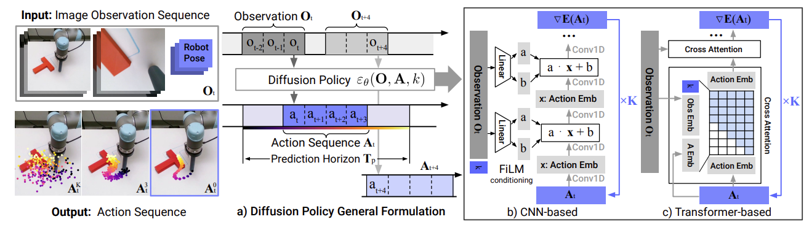
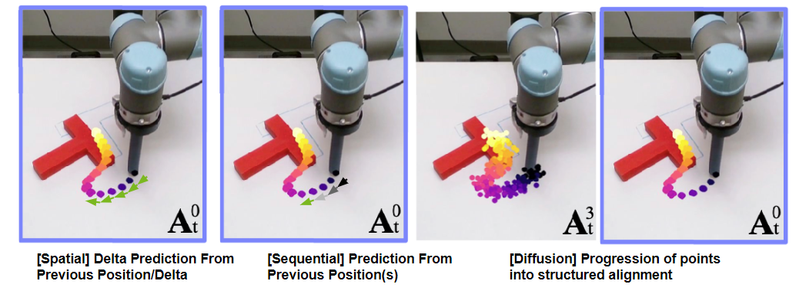

# Policy Network 與 Diffusion Policy 詳細介紹

---

## 1️⃣ MDP 與策略基礎

我們通常用馬可夫決策過程（MDP）描述控制問題。狀態 \(s_t\)、動作 \(a_t\)、回饋 \(r_t\)、折扣 \(\gamma\)：

$$
J(\pi_\theta) = \mathbb{E}_{\tau\sim\pi_\theta}\Big[\sum_{t=0}^{T}\gamma^t r(s_t,a_t)\Big]
$$

策略（Policy）是條件分佈：

$$
\pi_\theta(a_t|s_t)\quad \text{或} \quad \pi_\theta(a_{t:t+H-1}|o_{t-K:t})
$$

---

## 2️⃣ Policy Network（策略網路）

### 2.1 形式

常見連續控制策略：
$$
\pi_\theta(a|s)=\mathcal{N}\!\big(a\;|\;\mu_\theta(s),\Sigma_\theta(s)\big),\quad
a=\tanh(\tilde a),~\tilde a\sim \mathcal{N}(\mu_\theta,\Sigma_\theta)
$$

### 2.2 訓練方法

- **Policy Gradient (REINFORCE)**：
$$
\nabla_\theta J = \mathbb{E}\big[\nabla_\theta \log \pi_\theta(a_t|s_t)\,\hat A_t\big]
$$

- **Actor–Critic / PPO / SAC**
  - PPO：限制策略更新的 KL。
  - SAC：同時最大化熵：
    $$
    J_{\text{SAC}}=\mathbb{E}[Q_\phi(s_t,a_t)-\alpha\log\pi_\theta(a_t|s_t)]
    $$

- **行為克隆 (Behavior Cloning)**：
$$
\max_\theta \mathbb{E}_{(s,a)\sim \mathcal{D}}\,[\log\pi_\theta(a|s)]
$$

### 2.3 特性

| 優點 | 缺點 |
|------|------|
| 推論快（單步 forward） | 對多峰策略表現差，容易平均化 |
| RL/BC 工具成熟 | BC 對示範噪聲敏感，RL 互動成本高 |

---

## 3️⃣ Diffusion Policy（擴散式策略）

### 3.1 核心概念

將動作或整段軌跡視為條件生成任務，用 **擴散模型** 逐步去噪生成。

前向加噪：
$$
q(x_t|x_{t-1})=\mathcal{N}(x_t|\sqrt{1-\beta_t}x_{t-1},\beta_tI)
$$

訓練降噪器：
$$
\mathcal{L}_{\text{diff}}=\mathbb{E}_{t,x_0,\epsilon}\big[\|\epsilon-\epsilon_\theta(x_t,t;\text{cond})\|_2^2\big]
$$

條件 **cond** 可為最近觀測、目標、語音指令等。

### 3.2 兩種生成模式

- **單步**：每次產生 \(a_t\)
- **軌跡**：一次生成 \(a_{t:t+H-1}\)，常用 receding horizon 執行

### 3.3 引導方法

- **Classifier-Free Guidance (CFG)**：
$$
\hat\epsilon=\epsilon_\theta(x_t,t;\varnothing)+w[\epsilon_\theta(x_t,t;\text{cond})-\epsilon_\theta(x_t,t;\varnothing)]
$$

- **Q-Function Guidance**：用價值函數或 Q 值引導抽樣，偏向高回饋。

### 3.4 特性

| 優點 | 缺點 |
|------|------|
| 天然支援多模態、多峰分佈 | 推論慢（需多步去噪） |
| 對示範噪聲較魯棒 | 訓練/記憶體成本高 |
| 可融入高層條件與價值引導 | 工程較複雜 |

---

## 4️⃣ Policy vs Diffusion Policy 對照

| 面向 | Policy Network | Diffusion Policy |
|------|---------------|------------------|
| 生成型態 | 單步 (a s) | 序列 (a_{t:t+H-1} o,g) |
| 表達能力 | 易單峰 | 多模態、長期一致性佳 |
| 訓練 | RL/BC | 主要離線示範，可加值引導 |
| 推論 | 極快 | 較慢（10~20 去噪步可加速） |
| 穩健性 | 對多樣示範敏感 | 對雜訊示範較魯棒 |
| 可控性 | 用 reward shaping | CFG / Q-guidance |

---

## 5️⃣ 機器人應用示例

- **狀態**：RGB + 關節角 + 力回饋
- **動作**：關節角增量 \(\Delta q\)
- **Policy Net**：BC + PPO/SAC 微調 → 即時控制
- **Diffusion Policy**：示範資料訓練 U-Net/Transformer，推論 10–20 去噪步，每次重規劃

---

## ✅ 結論

- **Policy Network**：單步分佈，推論快，適合即時控制，但難處理多解任務。  
- **Diffusion Policy**：將動作生成視為條件擴散，能表達多樣性和長期一致性，但推論較慢且實作較複雜。
---

以下是 **Policy Network 與 Diffusion Policy 之間的關係**，用比較與演進角度來說明：

---

## 1️⃣ 兩者定位

* **Policy Network**

  * 傳統 RL 與模仿學習的核心，直接學一個條件分佈 (\pi_\theta(a|s))。
  * 動作通常是 **單步抽樣**（高斯、Categorical、決定性）。

* **Diffusion Policy**

  * 本質上也是一種 **Policy Network**，只是將「策略分佈」建模為 **條件擴散生成模型**。
  * 將動作或整段軌跡視為一個隨機變數 (x_0)，透過加噪/去噪來學習 (p_\theta(x_0|o))。

> ✅ **可以視 Diffusion Policy 是 Policy Network 的一個特殊、生成式參數化方式**。

---

## 2️⃣ 演進關係

| 時代 | 策略表達                  | 訓練方式                               | 特點              |
| -- | --------------------- | ---------------------------------- | --------------- |
| 早期 | 單峰高斯或決定性網路            | Policy Gradient、Actor-Critic、BC    | 推論快，但難表達多解策略    |
| 中期 | 混合高斯、Normalizing Flow | RL / BC                            | 更靈活，但仍單步輸出      |
| 近年 | **Diffusion Policy**  | 用擴散模型建構 (\pi_\theta)，離線模仿+可加 RL 引導 | 能生成多峰、長期一致的動作序列 |

---

## 3️⃣ 技術連結

* **Policy Network = 概念框架**

  * 只定義「策略是一個函數 (\pi_\theta(a|s))」。

* **Diffusion Policy = 具體實作**

  * 讓 (\pi_\theta) 的形式改成擴散生成器：
    $$
    \pi_\theta(a_{t:t+H-1}|o) = p_\theta(x_0|o)
    $$
    其中 (x_0) 是動作序列，透過反向擴散逐步生成。

* **Policy Gradient 仍可用**

  * Diffusion Policy 訓練時通常先用 **行為克隆**（MSE 噪聲預測），
  * 也可在推論或離線強化學習中加上 **價值/Q 引導**，使擴散策略偏向高回饋樣本。

---

## 4️⃣ 關鍵差異

| 面向          | 傳統 Policy Network | Diffusion Policy     |
| ----------- | ----------------- | -------------------- |
| **動作表達**    | 單步、常用高斯           | 整段軌跡，逐步去噪生成          |
| **分佈能力**    | 易單峰               | 天然多模態                |
| **訓練來源**    | RL/BC             | 離線示範 + 可加 RL 引導      |
| **推論速度**    | 極快 (單 forward)    | 較慢 (多步去噪，但可加速)       |
| **與 RL 關係** | 本體                | 可看成 RL/BC 上的一種新策略參數化 |

---

## 5️⃣ 總結

* **Policy Network** 是一個總稱：任何可微分、可學習的策略近似器都屬於此範疇。
* **Diffusion Policy** 是 **Policy Network 的一種具體實現**，用擴散生成模型替代傳統高斯/流式分佈，使策略能：

  * 表達多樣解法（multi-modal）
  * 更穩健於示範噪聲
  * 支援長期一致的動作序列生成。

👉 **可以理解為：Diffusion Policy = 生成式 Policy Network（用 Diffusion 取代傳統分佈）。**
？
