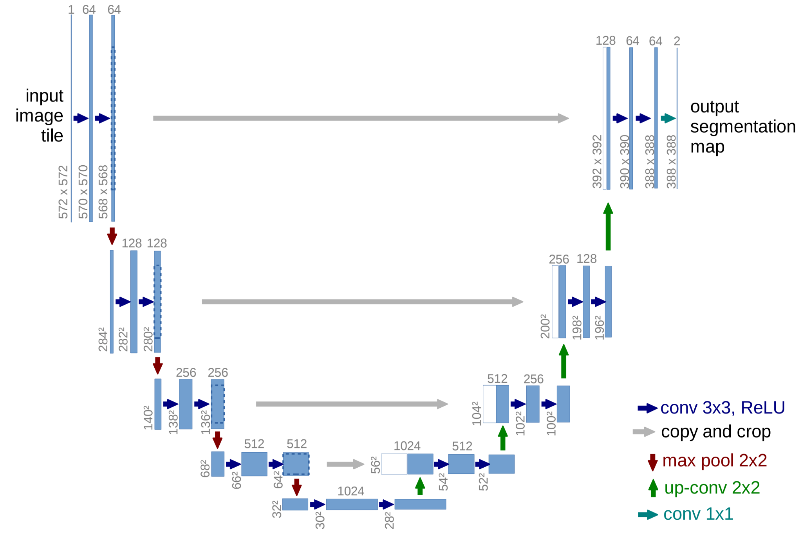

# Stable Diffusion（Stable Fusion）與 U-Net + CLIP 完整解析


## 1. Diffusion Model 基本概念

**擴散模型**把生成分成：

1. **前向擴散 (Noising)**：逐步加入高斯雜訊，將影像變為純噪聲。
2. **反向生成 (Denoising)**：學習一個網路逐步去噪，重建高品質影像。

Stable Diffusion 是 **Latent Diffusion Model (LDM)**：  
在 **VAE 壓縮後的潛在空間**運作，計算效率高、記憶體省。

---

## 2. 數學基礎

### 2.1 前向擴散
$$
q(\mathbf{x}_t|\mathbf{x}_0)=
\mathcal{N}\bigl(\mathbf{x}_t;\sqrt{\bar{\alpha}_t}\mathbf{x}_0,(1-\bar{\alpha}_t)\mathbf{I}\bigr)
$$

$$
\mathbf{x}_t=\sqrt{\bar{\alpha}_t}\mathbf{x}_0+\sqrt{1-\bar{\alpha}_t}\,\boldsymbol{\epsilon},\quad
\bar{\alpha}_t=\prod_{s=1}^t(1-\beta_s)
$$

### 2.2 反向去噪
$$
p_\theta(\mathbf{x}_{t-1}|\mathbf{x}_t)=
\mathcal{N}\bigl(\mathbf{x}_{t-1};\mu_\theta(\mathbf{x}_t,t),\sigma_t^2\mathbf{I}\bigr)
$$

$$
\mu_\theta(\mathbf{x}_t,t)=
\frac{1}{\sqrt{\alpha_t}}
\left(\mathbf{x}_t-\frac{\beta_t}{\sqrt{1-\bar{\alpha}_t}}\,\epsilon_\theta(\mathbf{x}_t,t)\right)
$$

---

## 3. Stable Diffusion 架構重點

- **VAE**：影像 ↔ 潛在空間壓縮
- **U-Net**：在潛在空間去噪
- **Cross-Attention**：文字條件注入影像特徵
- **Classifier-Free Guidance (CFG)**：控制 prompt 遵從度  
  $$
  \hat{\epsilon}=\epsilon_\text{uncond}+w(\epsilon_\text{cond}-\epsilon_\text{uncond})
  $$

---

## 4. CLIP 與 Stable Diffusion 的關係

### 4.1 CLIP 是什麼
- **CLIP (Contrastive Language-Image Pre-training)**：同時學習文字與影像的語義空間。
- 訓練時最大化匹配的 (文字, 圖片) 相似度，最小化不匹配樣本相似度。
- 提供一個 **能理解文字語意的 embedding**。

### 4.2 在 Stable Diffusion 中的角色
- **文字編碼器**：SD1.x / 2.x 使用 CLIP Text Encoder（如 ViT-L/14）；SDXL 用雙文本編碼器（OpenCLIP + CLIP）。
- Prompt 經 CLIP 轉成文字特徵向量 \(c\)。
- **U-Net 中的 Cross-Attention** 以 \(c\) 作為 `Key` / `Value`，將語意注入影像特徵：
  $$
  \text{Attention}(Q,K,V)=\mathrm{softmax}\left(\frac{QK^\top}{\sqrt{d}}\right)V
  $$
  - \(Q\)：影像特徵
  - \(K,V\)：CLIP 文本特徵

### 4.3 優點
- CLIP 能提供強大語意對齊，使模型理解抽象描述（如「cyberpunk cat」）。
- 與 CFG 搭配，可提高 prompt 控制力。

---

## 5. U-Net 架構示意

```

z_t ──► [Encoder Blocks] ──► [Bottleneck + Cross-Attention (CLIP embeddings)] ──► [Decoder Blocks] ──► εθ(z_t, t, c)
↓ skip                                                        ↑ skip

````


- **Encoder**：多層下採樣 (Conv + Norm + SiLU)
- **Bottleneck**：加入 timestep embedding + CLIP 條件
- **Decoder**：上採樣並與 encoder skip 連接
- **Cross-Attention**：利用 CLIP 文本特徵影響影像生成
- **Time Embedding**：告訴模型目前的雜訊程度

### 簡化程式碼範例
```python
class SimpleUNet(nn.Module):
    def __init__(self, latent_dim=4, base=320):
        super().__init__()
        self.time_mlp = nn.Sequential(
            nn.Linear(320, base), nn.SiLU(), nn.Linear(base, base)
        )
        self.down1 = ConvBlock(latent_dim, base)
        self.down2 = ConvBlock(base, base*2, down=True)
        self.mid   = ResBlock(base*2, time_emb_dim=base)
        self.up2   = ConvBlock(base*2, base, up=True)
        self.out   = nn.Conv2d(base, latent_dim, 1)

    def forward(self, x, t, context):
        t_emb = self.time_mlp(timestep_embedding(t))
        h1 = self.down1(x, t_emb)
        h2 = self.down2(h1, t_emb)
        h  = self.mid(h2, t_emb, context)  # Cross-Attention 融入 CLIP 向量
        h  = self.up2(h, t_emb, skip=h1)
        return self.out(h)
````

---

## 6. 版本差異

* **SD 1.x**：CLIP ViT-L/14，512px，ε-prediction
* **SD 2.x**：OpenCLIP，768px，v-prediction
* **SDXL**：雙文本編碼器 (OpenCLIP + CLIP) + Base/Refiner 架構，1024px，高品質細節

---

## 7. 控制與微調

* **ControlNet**：利用邊緣/深度/姿勢圖精準控制構圖。
* **LoRA / Textual Inversion / DreamBooth**：快速微調或加入新概念。
* **IP-Adapter**：讓參考圖影響風格與結構。

---

## 8. 總結

* **Stable Diffusion = VAE 潛在空間 + U-Net 去噪 + CLIP 文本理解 + Cross-Attention**
* CLIP 提供語意空間，使文字 prompt 能準確影響影像生成。
* CFG 與 CLIP 搭配可調整語意服從度，ControlNet / LoRA 提供更進階控制。
* SDXL 為最新高解析度版本，畫質最佳。


