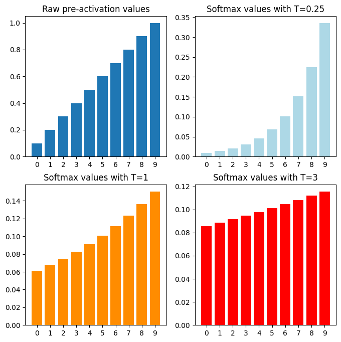

# Temperature、Top-p、Top-k — 專業教學（純 Markdown 版）

## 1. 概述

在自然語言生成 (NLG) 中，模型每次輸出時會給出 **logits 向量 z**，代表每個詞元 (token) 的未正規化分數。
為控制輸出文字的隨機性、創造力與穩定性，最常用的抽樣技術包含：

* **Temperature (溫度)**
* **Top-k Sampling**
* **Top-p (Nucleus Sampling)**

---

## 2. 原理與公式（文字化表示）

### 2.1 Temperature（溫度）

Temperature 調整 logits 的陡峭度，再經 softmax 轉換為機率分佈：


$$
p_i(T) = \frac{\exp\!\bigl(z_i / T\bigr)}
               {\sum_{j} \exp\!\bigl(z_j / T\bigr)}
$$


* T < 1 ：分佈更尖銳，模型偏好高機率詞元 → 輸出穩定、保守
* T > 1 ：分佈更平滑，低機率詞元被選中機率上升 → 輸出更隨機、創造力更強


---

### 2.2 Top-k Sampling

僅保留機率最高的 k 個詞元，其餘全部丟棄並重新正規化：

```
K = 取機率最高的 k 個 token
```

* k 小：輸出穩定但多樣性降低
* k 大：多樣性增加，但可能引入低品質選項

---

### 2.3 Top-p (Nucleus Sampling)

按機率排序，取累積機率剛達到門檻 p 的最小集合 S：

```
S = { token_1, token_2, ... }，直到 Σ(prob) ≥ p
```

* p 小：僅取高機率詞元，輸出保守
* p 大：自由度高，創造性強

---

### 2.4 抽樣流程

1. **溫度縮放**： z = z / T
2. **Top-k 過濾** (可選)
3. **Top-p 過濾** (可選)
4. **重新正規化後抽樣**

> 常見實作順序： **Temperature → Top-k → Top-p → Sampling**

---

## 3. 實務參數建議

| 使用場景             | Temperature | Top-p    | Top-k  | 特點        |
| ---------------- | ----------- | -------- | ------ | --------- |
| 嚴謹任務（翻譯、摘要、事實問答） | 0.2–0.5     | 0.8–0.9  | 20–50  | 減少幻覺、保持一致 |
| 一般對話助理           | 0.5–0.8     | 0.9      | 40–80  | 平衡穩定性與創意  |
| 創意寫作 / 腦暴        | 0.9–1.3     | 0.9–0.95 | 80–200 | 高自由度、想像力強 |
| 程式碼生成            | 0–0.4       | 0.8–0.95 | 20–50  | 保持精確與可執行  |
| 多輪規劃 / 工具調用      | 0.2–0.6     | 0.85–0.9 | 40–60  | 減少跑題與錯誤   |

**推薦預設組合：**

* Precise：`T = 0.3, top_p = 0.85`
* Balanced：`T = 0.7, top_p = 0.9`
* Creative：`T = 1.1, top_p = 0.95`
* Coding：`T = 0.2, top_k = 40`

---

## 4. 常見問題與解決策略

| 問題      | 可能原因         | 解決方式                      |
| ------- | ------------ | ------------------------- |
| 內容胡言亂語  | 溫度過高 / 範圍過廣  | 降低 T，或減小 p、k              |
| 重複句子過多  | 分佈過尖 / 無重複懲罰 | 降 T、增加 repetition penalty |
| 結果僵硬無變化 | 過度限制         | 提高 T 或放寬 p、k              |
| 答案不一致   | 隨機性過高        | 使用 T=0（貪婪解碼）或降低 T         |
| 長文偏題    | 尾端候選過於開放     | 降 T，減小 p，或設定較小 k          |

---

## 5. 參考程式碼

```python
logits = logits / T  # Temperature 縮放

# Top-k
if top_k:
    keep_idx = logits.topk(top_k).indices
    mask = torch.full_like(logits, float('-inf'))
    mask[keep_idx] = logits[keep_idx]
    logits = mask

# Top-p
if top_p:
    probs = torch.softmax(logits, dim=-1)
    sorted_probs, sorted_idx = torch.sort(probs, descending=True)
    cdf = torch.cumsum(sorted_probs, dim=-1)
    cutoff = cdf > top_p
    cutoff_idx = torch.argmax(cutoff.int())
    keep_idx = sorted_idx[:cutoff_idx+1]
    mask = torch.full_like(logits, float('-inf'))
    mask[keep_idx] = logits[keep_idx]
    logits = mask

probs = torch.softmax(logits, dim=-1)
token = torch.multinomial(probs, 1)
```

---

## 6. 快速調參流程

1. **起點**：`T = 0.7, top_p = 0.9`
2. 若輸出過隨機 → 降 T 或減小 p/k
3. 若輸出僵硬 → 升 T 或放寬 p/k
4. 若長文本重複 → 降 T，加入重複懲罰
5. 找到最佳組合後記錄，建立專案預設設定

---

## 7. 專業備忘錄

* 想穩定：降低 T、降低 p、縮小 k
* 想創意：提高 T、提高 p、增大 k
* 安全預設：`T = 0.7 + top_p = 0.9` 幾乎適用於大部分對話生成

